# 二叉树理论

> 来源：[代码随想录 - 二叉树理论基础篇](https://programmercarl.com/%E4%BA%8C%E5%8F%89%E6%A0%91%E7%90%86%E8%AE%BA%E5%9F%BA%E7%A1%80.html)
> 

---

## 一、二叉树的种类

解题过程中二叉树主要有两种形式：**满二叉树**和**完全二叉树**。此外还有**二叉搜索树**和**平衡二叉搜索树**。

### 1.1 满二叉树

- **定义**：只有度为 0 和度为 2 的节点，且度为 0 的节点都在同一层。
- **性质**：深度为 $k$，有 $2^k - 1$ 个节点。

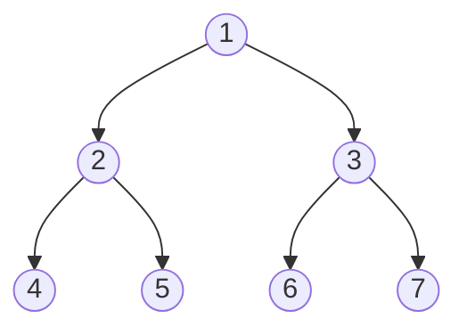

> 深度 k=3，节点总数 $2^3-1=7$。所有叶子节点（4,5,6,7）在同一层。

### 1.2 完全二叉树

- **定义**：除最底层外，其余每层节点数都达到最大值；最底层节点集中在该层**最左边**的若干位置。
- 若最底层为第 $h$ 层（$h$ 从 1 开始），则该层包含 $1 \sim 2^{h-1}$ 个节点。
- ⚠️ **注意**：很多同学对完全二叉树并不是真正理解，容易判断错（原博主举了典型反例）。
- **堆**（PriorityQueue）就是一棵完全二叉树，同时保证父子节点的顺序关系。

✅ **是完全二叉树**（底层节点靠左）：

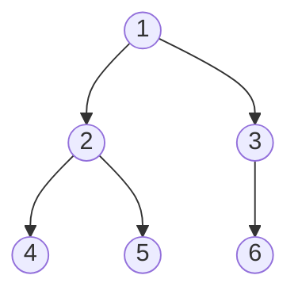

❌ **不是完全二叉树**（底层节点不靠左，有空隙）：

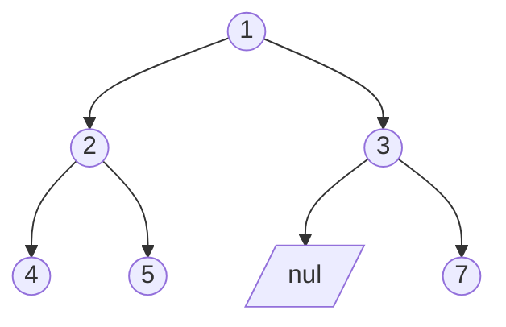

### 1.3 二叉搜索树（BST，Binary Search Tree）

- **定义**：有数值的**有序树**，满足：
  - 左子树所有节点的值 **<** 根节点的值
  - 右子树所有节点的值 **>** 根节点的值
  - 左右子树也分别是二叉搜索树

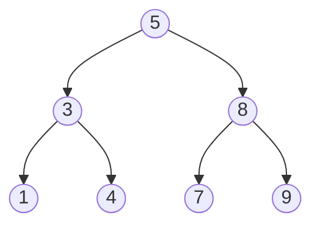

> 中序遍历结果：1, 3, 4, 5, 7, 8, 9（严格升序）

### 1.4 平衡二叉搜索树（AVL 树）

- **定义**：一棵空树，或左右子树高度差绝对值 $\leq 1$，且左右子树都是平衡二叉树。
- **实际应用**：C++ 中 `map`、`set`、`multimap`、`multiset` 底层都是平衡二叉搜索树（红黑树），增删操作时间复杂度 $O(\log n)$。
- `unordered_map` / `unordered_set` 底层是**哈希表**。
- Java 中 `TreeMap` / `TreeSet` 底层是红黑树，`HashMap` / `HashSet` 底层是哈希表。

✅ **平衡二叉树**（每个节点左右子树高度差 ≤ 1）：

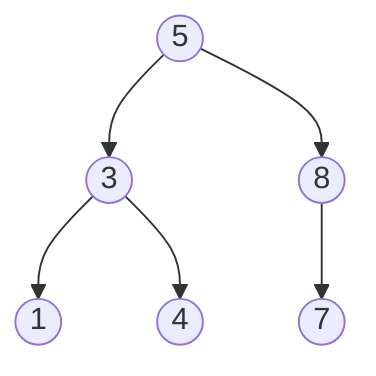

❌ **非平衡二叉树**（节点 5 左子树高度=2，右子树高度=0，差 > 1）：

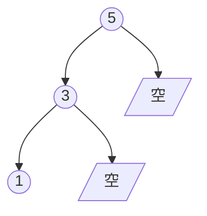

> ⚠️ 一定要清楚所用语言常用容器的底层实现，否则无法正确分析自己代码的性能！

---

## 二、二叉树的存储方式

二叉树可以**链式存储**，也可以**顺序存储**。

### 2.1 链式存储（最常用）

- 用**指针**将散落在各地址的节点串联起来。
- 直观易懂，一般都用链式存储。

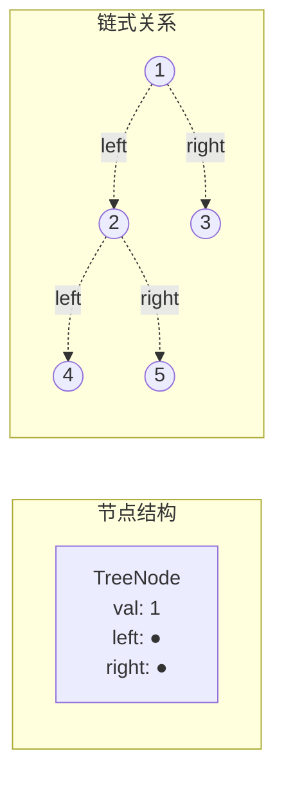

### 2.2 顺序存储（数组）

- 用**数组**存储，元素在内存中连续分布。
- **父子下标关系**：父节点下标 $i$ 时：
  - 左孩子：$i \times 2 + 1$
  - 右孩子：$i \times 2 + 2$

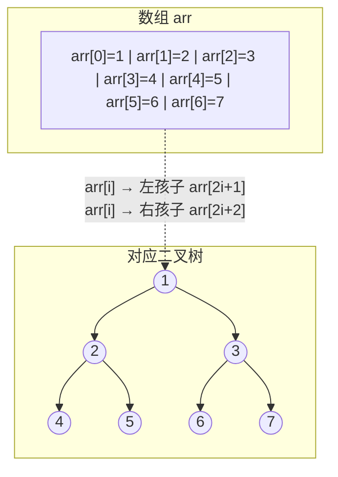

> ⚠️ 用数组一样可以表示二叉树，要了解这种思路（虽然平时很少直接用）。

---

## 三、二叉树的遍历方式

二叉树主要有两种遍历方式，这是**图论中最基本的两种遍历方式**：

### 3.1 两大遍历体系

| 遍历类型 | 说明 | 常用实现 |
|---------|------|---------|
| **深度优先遍历（DFS）** | 先往深走，遇叶子节点再回退 | 递归（本质是栈） |
| **广度优先遍历（BFS）** | 一层一层地遍历 | 队列（先进先出） |

### 3.2 深度优先遍历（DFS）的三种顺序

> 🔑 **记忆技巧**：前/中/后 指的是**中间节点**的遍历顺序！

以如下二叉树为例：


| 遍历方式 | 遍历顺序 | 输出结果 | 实现方法 |
|---------|---------|---------|---------|
| **前序遍历** | **中** → 左 → 右 | 1, 2, 4, 5, 3, 6, 7 | 递归法 / 迭代法 |
| **中序遍历** | 左 → **中** → 右 | 4, 2, 5, 1, 6, 3, 7 | 递归法 / 迭代法 |
| **后序遍历** | 左 → 右 → **中** | 4, 5, 2, 6, 7, 3, 1 | 递归法 / 迭代法 |

### 3.3 广度优先遍历（BFS）

| 遍历方式 | 实现方法 |
|---------|---------|
| **层次遍历（层序遍历）** | 迭代法（用队列） |

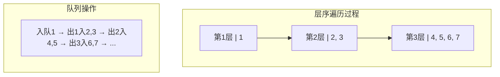

> 层序遍历结果：1, 2, 3, 4, 5, 6, 7（逐层从左到右）

### 3.4 实现原理

- **DFS 用递归实现最方便**，递归本质上就是**栈**的一种实现结构 → 前中后序的逻辑都可以借助**栈**用非递归（迭代）方式实现。
- **BFS 用队列实现**，利用队列先进先出的特点，才能一层一层地遍历二叉树。
- 这里体现了**栈与队列的一个经典应用场景**。

---

## 四、二叉树的定义（Java）

二叉树的节点定义和链表类似，**比链表多了一个指针**（两个指针分别指向左右孩子）。

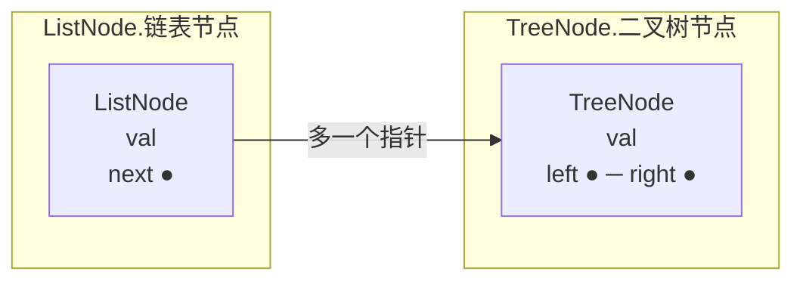

```java
public class TreeNode {
    int val;
    TreeNode left;
    TreeNode right;

    TreeNode() {}
    TreeNode(int val) { this.val = val; }
    TreeNode(int val, TreeNode left, TreeNode right) {
        this.val = val;
        this.left = left;
        this.right = right;
    }
}
```

---

## 五、总结

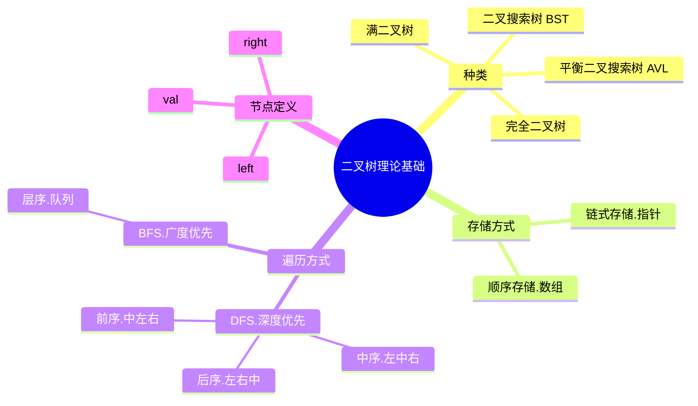

- 二叉树是算法面试的**常客**，也是众多数据结构的**基石**。
- 本篇核心脉络：**种类 → 存储方式 → 遍历方式 → 定义**，比较全面地覆盖了二叉树各方面的重点。
- **递归**是二叉树的核心：代码简短，但"一看就会，一写就废"，必须多练。
- 后续具体遍历的实现（递归/迭代/统一迭代/层序）会在后续章节详细讲解。
