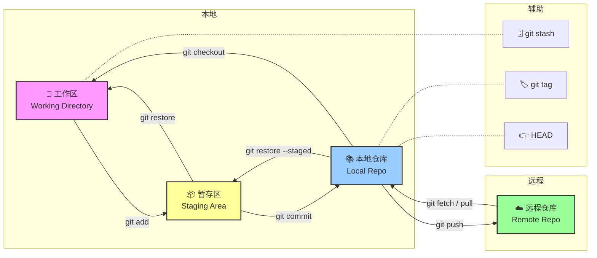
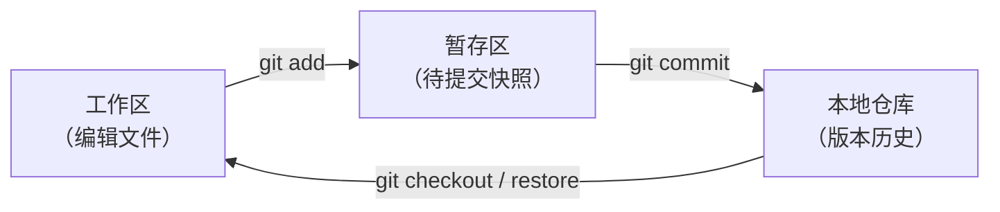
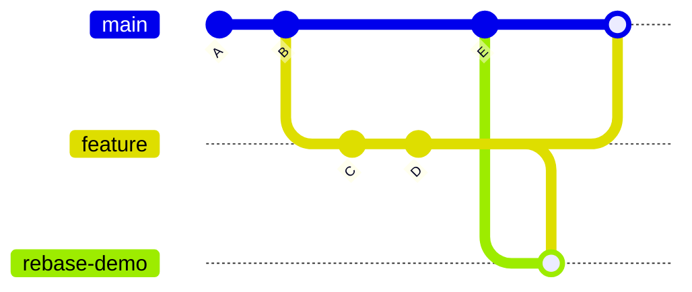
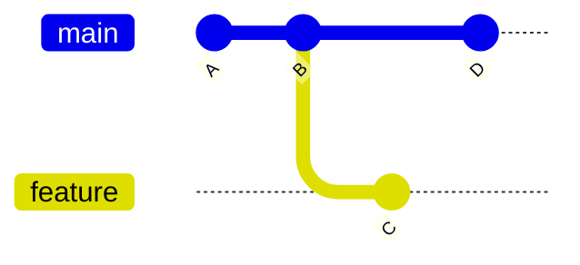

# Git Tips


## 前言

因为工作中每天都会使用，一直觉得这是没必要单独整理的内容，但是需要用到的时候又总是卡壳，然后面向 Gemini 敲命令。

还是老实写个给自己看的 `Tips` 了...



---

## 一、基础概念

### 工作区、暂存区、本地仓库

Git 将文件状态划分为三个区域：

| 区域 | 对应目录 | 说明 |
|------|---------|------|
| 工作区 | 项目文件夹 | 你正在编辑的文件 |
| 暂存区 | `.git/index` | `git add` 后的文件快照，准备提交 |
| 本地仓库 | `.git/objects` | `git commit` 后的版本历史 |



### 提交对象与哈希值

每次 `git commit` 生成一个不可变的**提交对象**，包含：

- 文件快照（tree 对象）
- 作者、时间戳、提交信息
- 父提交的 SHA-1 哈希（形成链式历史）

哈希值（如 `8a3b2c1...`）是内容寻址的——相同内容永远产生相同哈希，任何修改都会改变哈希。

> 短哈希可用前 7 位，`git log --oneline` 默认显示。

### 分支与引用

**分支本质上是一个指向某个提交的轻量指针**，存放在 `.git/refs/heads/` 下。

```bash
# 查看分支指向的提交
cat .git/refs/heads/main     # 输出：8a3b2c1...
git rev-parse main            # 同上
```

引用类型：

| 路径 | 含义 |
|------|------|
| `refs/heads/*` | 本地分支 |
| `refs/remotes/origin/*` | 远程跟踪分支 |
| `refs/tags/*` | 标签 |
| `HEAD` | 当前检出位置（通常指向某个分支） |

### HEAD 与 Detached HEAD

- **HEAD** 是一个符号引用，通常指向当前分支（如 `refs/heads/main`）
- **Detached HEAD**：HEAD 直接指向某个提交哈希而非分支。此时新提交不会属于任何分支，切换分支后可能丢失

```bash
git checkout <commit-hash>               # 进入 Detached HEAD
git checkout -b <new-branch> <hash>      # 从 detached 状态创建新分支
```

---

## 二、仓库配置

### 初始化仓库

```bash
git init                      # 在当前目录创建新仓库
git clone <url>               # 克隆远程仓库到本地
git clone -b <branch> <url>   # 克隆指定分支
```

`git init` 会生成 `.git/` 目录，包含所有版本数据。`git clone` = `git init` + `git remote add` + `git fetch` + `git checkout`。

### 用户配置（git config）

```bash
git config --global user.name "Your Name"
git config --global user.email "you@example.com"
```

配置层级（后者覆盖前者）：

| 层级 | 文件位置 | 作用域 |
|------|---------|--------|
| system | `/etc/gitconfig` | 所有用户 |
| global | `~/.gitconfig` | 当前用户 |
| local | `.git/config` | 当前仓库 |

```bash
git config --list              # 查看所有配置
git config --global --edit     # 编辑全局配置
```

### .gitignore

指定 Git 忽略的文件/目录，支持 glob 模式：

```gitignore
node_modules/
*.log
.env
dist/
```

规则：

- `/dir/` 忽略目录
- `*.ext` 通配符匹配
- `!pattern` 取反（不忽略）
- 已跟踪的文件不受 `.gitignore` 影响，需先 `git rm --cached`

---

## 三、日常操作

### 查看状态（git status）

```bash
git status                      # 详细状态
git status --short              # 简略状态（?? 未跟踪, M 已修改, A 已暂存）
```

### 暂存与取消暂存

```bash
git add <file>                  # 暂存指定文件
git add .                       # 暂存所有改动
git add -p                      # 交互式选择暂存片段
git restore --staged <file>     # 取消暂存（保留工作区改动）
```

### 提交

```bash
git commit -m "feat: 描述"      # 提交暂存区内容
git commit -am "描述"           # 跳过 add，直接提交所有已跟踪文件的改动
git commit --amend              # 追加到上一次提交（改写历史，不要对已推送的提交使用）
```

### 查看历史（git log）

```bash
git log --oneline -5                 # 最近 5 条简略
git log --oneline beta ^main         # beta 有而 main 没有的提交
git log --graph --all --oneline      # 可视化分支图
git log -p                           # 显示每次提交的 diff
git reflog --oneline -10             # 最近 10 条 HEAD 移动
```

### 查看差异（git diff）

```bash
git diff                            # 工作区 vs 暂存区
git diff --staged                   # 暂存区 vs 最新提交
git diff main..beta                 # 两分支内容差异
git diff --stat main..beta          # 文件名级别差异
```

### 撤销工作区改动

```bash
git restore <file>                  # 丢弃工作区改动（用暂存区/最新提交覆盖）
git restore --source <hash> <file>  # 从指定提交恢复文件
git checkout -- <file>              # 旧式写法，效果同上
```

### 文件操作

```bash
git rm <file>                       # 删除文件并暂存删除
git rm --cached <file>              # 停止跟踪但保留本地文件
git mv <old> <new>                  # 重命名并暂存
```

---

## 四、分支操作

### 创建与切换分支

```bash
git branch <name>                   # 创建分支（不切换）
git checkout -b <name>              # 创建并切换
git switch -c <name>                # 新式写法（Git 2.23+）
git checkout <name>                 # 切换已有分支
git switch <name>                   # 新式写法
```

### 强制从指定分支重建

```bash
git checkout -B beta main   # 无论 beta 是什么状态，强制从 main 重建
```

`-B` 等价于：如果 beta 存在就 reset 到 main，不存在就创建。比"删了再建"简洁。

### 删除分支

```bash
git branch -d <name>                # 安全删除（已合并才允许）
git branch -D <name>                # 强制删除（丢弃未合并改动）
```

### 重命名分支

```bash
git branch -m <old> <new>           # 重命名本地分支
```

### 查看分支信息

```bash
git branch                          # 列出本地分支
git branch -r                       # 列出远程跟踪分支
git branch -a                       # 列出所有分支
git branch --show-current           # 当前分支名
git branch -v                       # 分支列表 + 最新提交摘要
```

### 查看分支独有提交

```bash
git log --oneline beta ^main        # beta 有而 main 没有的提交
```

### 查看共同祖先

```bash
git merge-base main beta            # 两分支共同祖先的提交哈希
```

---

## 五、合并与变基



### 普通合并（git merge）

```bash
git checkout main
git merge feature
```

两种合并模式：

| 模式 | 条件 | 结果 |
|------|------|------|
| Fast-forward | main 没有新提交 | 直接移动指针，无合并提交 |
| Three-way merge | 两分支各有新提交 | 生成合并提交（两个 parent） |

```bash
git merge --no-ff feature           # 禁用 fast-forward，强制生成合并提交
```

### Squash Merge

```bash
git checkout main
git merge --squash beta; git commit -m "feat: 摘要"
git push origin main
```

> ⚠️ **Windows PowerShell 用 `;` 而非 `&&`。** Bash/Zsh 用 `&&`。

### Squash 底层原理

Squash 本质是 `git rebase -i`（交互式变基）。假设选中 3 个提交，Git 会：

1. 把这几次提交的代码改动合并成一个快照
2. 把各提交日志拼在一起，让你重新编辑
3. 废弃旧提交，生成一个全新哈希的单次提交

```
【操作前】  提交A → 提交B → 提交C
【操作后】  新的提交 A'（包含 A+B+C 的所有改动）
```

**⚠️ 铁律：只 squash 还没推送的本地提交。** 如果 squash 了已推送的提交，推送时必须 `-f` 强推，会覆盖远端历史。

### Squash 的坑

**1. SQUASH_MSG 自动填入所有提交标题**

`git merge --squash` 会把 beta 上所有提交标题写入 `.git/SQUASH_MSG`，单独 `git commit`（不带 `-m`）时编辑器会满屏提交列表。

解法：**必须紧跟 `; git commit -m "..."`**，`-m` 直接覆盖模板。

`--no-log` 参数对 `--squash` **无效**，不用试。

**2. Squash 合并后 beta 没同步，再次合并会冲突**

Squash 只在 main 上创建一条新提交，beta 毫无变化。beta 上继续提交后，再 squash 会出现 `CONFLICT (add/add)`。

解法：每次 squash 后同步 beta：

```bash
git checkout -B beta main; git push -f origin beta
```

**3. Squash 后 git 拒绝再次 merge**

如果有一次 squash 没冲突但 beta 上还有新改动，再次 `git merge --squash` 可能报 `Already up to date`——因为 git 认为该分支已被合并。

解法：用 `git checkout beta -- <files>` 手动拷文件到 main，再提交。

### 变基（git rebase）

```bash
git checkout feature
git rebase main                # 把 feature 的提交"搬"到 main 顶端
```



> Rebase 前：feature 基于 B，main 已到 D → **Rebase 后**：feature 的提交被重放到 D 之后，历史变成线性。

**⚠️ 铁律：不要 rebase 已推送的公开分支。** 会改写提交哈希，协作者本地历史将与你冲突。

```bash
git rebase -i HEAD~3               # 交互式变基最近 3 个提交（squash/fixup/reword）
git rebase --abort                  # 中止变基
git rebase --continue               # 解决冲突后继续
```

### Cherry-pick

```bash
git cherry-pick <commit-hash>       # 把指定提交"摘"到当前分支
git cherry-pick A..B                # 摘取 A（不含）到 B（含）之间的提交
```

适合场景：只需要另一个分支的某个特定修复，不想合并整个分支。

### 冲突处理

#### 中止当前合并

```bash
git merge --abort
```

> Squash merge 没有 `MERGE_HEAD`，`--abort` 可能失败。此时用 `git reset --hard HEAD`。

#### 冲突时接受某一方版本

```bash
git checkout --theirs path/to/file    # 接受对方（被合并分支）的版本
git checkout --ours path/to/file      # 接受当前分支的版本
```

---

## 六、远程协作

### 添加与查看远程仓库

```bash
git remote -v                                          # 查看远程仓库 URL
git remote add <name> <url>                            # 添加远程仓库
git remote set-url origin <new-url>                    # 修改远程 URL
```

### 推送

```bash
git push origin <branch>                               # 推送分支
git push -u origin <branch>                            # 首次推送并建立追踪
```

`-u`（`--set-upstream`）绑定本地与远程分支，之后只需 `git push` / `git pull`。

### 强制推送

```bash
git push -f origin <branch>
```

**何时用**：reset / rebase / 同步 beta 到 main 后。**注意**：会覆盖远端历史，确保远端没有别人的提交。

### 强推与分支保护权限

强推（`git push -f`）能否成功取决于仓库的分支保护设置：

| 角色 | 主分支（main/master） | 个人 feature 分支 |
|------|----------------------|-------------------|
| Developer | ❌ 被拒绝 | ✅ 通常允许 |
| Maintainer / Admin | ✅ 可临时解保后强推 | ✅ 允许 |

如果被拒绝（报 `protected` 字样），需到 Git 托管平台（GitLab/GitHub）的 Settings → Protected Branches 中临时解除保护，操作完再重新加上。

### 拉取与获取

```bash
git fetch origin                    # 下载远程更新，不合并
git pull origin main                # = fetch + merge
git pull --rebase origin main       # = fetch + rebase（推荐，保持线性历史）
```

> `git pull --rebase` 避免无意义的合并提交，是更干净的做法。

### 删除远端分支

```bash
git push origin --delete <branch>
```

### 从另一分支拿文件

```bash
git checkout beta -- path/to/file   # 把 beta 的文件拷到当前分支
```

适合 squash 合并后无法再次 merge 时手动同步剩余改动。

---

## 七、回退与恢复

### 回退到指定提交（git reset）

```bash
git reset --soft <hash>             # HEAD 回退，暂存区和工作区不变
git reset --mixed <hash>            # HEAD + 暂存区回退，工作区不变（默认）
git reset --hard <hash>             # 全部回退，丢弃所有改动
git push -f origin <branch>         # 同步远端
```

| 模式 | HEAD | 暂存区 | 工作区 | 用途 |
|------|------|--------|--------|------|
| `--soft` | ✅ | 保留 | 保留 | 重新组织提交 |
| `--mixed` | ✅ | ✅ | 保留 | 取消暂存 |
| `--hard` | ✅ | ✅ | ✅ | 彻底回退 |

### 安全回退（git revert）

```bash
git revert <hash>                   # 创建一个新提交来"撤销"指定提交
git revert HEAD                     # 撤销最新一次提交
```

> `revert` 不修改历史，适合已推送的提交。`reset` 修改历史，只适合本地未推送的提交。

### 用 reflog 恢复误删的提交

```bash
git reflog <branch> --oneline         # 查看分支的历史 HEAD 位置
git reset --hard <commit-hash>        # 恢复到那个位置
```

`reflog` 保留 30 天内的所有 HEAD 移动记录，即使 `reset --hard` 或 `branch -D` 也能恢复。

### 误删分支恢复（本地 + 远程）

只要代码曾经被 `commit` 过，Git 几乎不会真正丢失它。即使本地和远程分支都被删了，提交记录依然在 Git 底层数据库里。

> ⚠️ 唯一例外：如果代码只写在工作区、从未 `git add` / `git commit`，那就无法恢复。

**Step 1：找回提交哈希**

```bash
git reflog
```

在输出中找到删除前最后一次提交，类似：

```
8a3b2c1 HEAD@{2}: commit: 修复了登录页面的Bug
```

前面的 `8a3b2c1` 就是提交哈希。

**Step 2：从哈希重建本地分支**

```bash
git checkout -b <分支名> <哈希值>
# 例如：git checkout -b feature-login 8a3b2c1
```

如果同名分支已存在（报 `already exists`），用大写 `-B` 强制覆盖：

```bash
git checkout -B <分支名> <哈希值>
```

**Step 3：推送恢复远程分支**

```bash
git push -u origin <分支名>      # 首次推送并建立追踪
git push -u origin <分支名> -f   # 如果远端有冲突，需要强推
```

---

## 八、暂存与储藏（git stash）

临时保存工作区改动而不提交，常用于需要切换分支但不想提交半成品时。

### 储藏改动

```bash
git stash                           # 储藏所有已跟踪文件的改动
git stash push -m "描述"            # 带描述信息储藏
git stash -u                        # 同时储藏未跟踪文件
```

### 查看储藏列表

```bash
git stash list                      # 列出所有储藏
```

### 恢复储藏

```bash
git stash pop                       # 恢复最近一次储藏并删除记录
git stash apply                     # 恢复但保留储藏记录
git stash pop stash@{1}             # 恢复指定储藏
```

### 删除储藏

```bash
git stash drop                      # 删除最近一次储藏
git stash clear                     # 清空所有储藏
```

---

## 九、标签（git tag）

为某个提交打上不可变的标记，常用于标记发布版本。

### 创建标签

```bash
git tag v1.0.0                                      # 轻量标签（仅指针）
git tag -a v1.0.0 -m "发布 1.0"                      # 附注标签（含信息+签名）
git tag -a v1.0.0 <commit-hash>                     # 给历史提交打标签
```

### 查看标签

```bash
git tag                                             # 列出所有标签
git tag -l "v1.*"                                   # 按模式过滤
git show v1.0.0                                     # 查看标签详情
```

### 推送标签

```bash
git push origin v1.0.0                              # 推送单个标签
git push origin --tags                              # 推送所有本地标签
```

### 删除标签

```bash
git tag -d v1.0.0                                   # 删除本地标签
git push origin --delete v1.0.0                     # 删除远程标签
```

---

## 十、高级操作

### 二分查找（git bisect）

用二分法快速定位引入 bug 的提交：

```bash
git bisect start
git bisect bad HEAD                 # 标记当前版本有问题
git bisect good v1.0.0              # 标记已知正常版本
# Git 自动 checkout 到中间版本，测试后标记 good/bad
git bisect good                     # 或 git bisect bad
# 重复直到定位到问题提交
git bisect reset                    # 结束 bisect，回到原始状态
```

### 追溯代码（git blame）

查看每一行代码是谁在何时修改的：

```bash
git blame <file>                    # 逐行显示作者和提交
git blame -L 10,20 <file>           # 只看指定行范围
```

### 工作树（git worktree）

同时检出多个分支到不同目录，无需来回切换：

```bash
git worktree add ../project-hotfix hotfix    # 在上级目录检出 hotfix 分支
git worktree list                            # 列出所有工作树
git worktree remove ../project-hotfix        # 删除工作树
```

---

## 十一、跨平台注意

| Bash/Zsh | PowerShell |
|----------|-----------|
| `&&` | `;` |
| `2>/dev/null` | `2>$null` |
| `$?` | `$LASTEXITCODE` |

