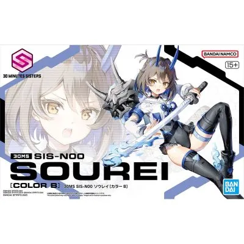

```haskell
record DrinkMenu where
	constructor MkDrinkMenu
	spiritIngredients : List String
	allIngredients    : List String

myPianoManMenu : DrinkMenu
myPianoManMenu = MkDrinkMenu
	["龙舌兰", "蓝橙利口酒", "紫罗兰利口酒"]
	[""]

```




## Tips


