# GitHub Copilot Agent 规范化配置

## 前言

GitHub Copilot 的 Agent 模式能直接编辑文件、执行命令，极大提升效率，但也带来了两个核心问题：

1. **安全**：Agent 可能误操作主分支、执行危险命令
2. **可追溯**：Agent 的修改难以排查和回滚

本文基于 Hooks → AGENTS.md → Skills 三级规范结构，构建一套**泛用、安全、可审查**的 Agent 工作流。

---

## 三级结构总览

```mermaid
flowchart TD
    subgraph ALWAYS["🟢 每次对话必读（精简）"]
        AGENTS["📄 AGENTS.md"]
        A1["项目概览"]
        A2["目录职责"]
        A3["常用命令"]
        A4["安全约束"]
        A5["核心约定"]
        A6["Skill 引用"]
        AGENTS --> A1
        AGENTS --> A2
        AGENTS --> A3
        AGENTS --> A4
        AGENTS --> A5
        AGENTS --> A6
    end

    subgraph ONDEMAND["🟡 需要时才读（详情）"]
        SKILLS["📂 Skills/*"]
        S1["git-workflow"]
        S2["...按需扩展"]
        SKILLS --> S1
        SKILLS --> S2
    end

    subgraph LIFECYCLE["🔵 生命周期自动触发"]
        HOOKS["⚡ Hooks/*"]
        H1["SessionStart → 切分支"]
        H2["PreToolUse → 阻断危险"]
        HOOKS --> H1
        HOOKS --> H2
    end

    A6 -.->|"按需加载"| SKILLS
    HOOKS -.->|"确定性强执"| AGENTS
```



| 层级 | 文件 | 加载时机 | 设计意图 |
|------|------|---------|---------|
| **AGENTS.md** | 根目录 | 每次对话必读 | 核心约定 + 安全底线，始终在上下文中 |
| **Hooks** | `.github/hooks/*.json` | 生命周期事件触发 | 确定性执行——切分支、阻断危险操作 |
| **Skills** | `.github/skills/<name>/SKILL.md` | 按需加载 | 详细信息，不占日常上下文 |

---

## 第一层：AGENTS.md — 核心约束

`AGENTS.md` 放在仓库根目录，Copilot **无条件自动读取**，每次对话都会注入到 system prompt。因此内容必须短小精悍，**控制在 30 行以内**以避免占用上下文空间

### 模板

```markdown
# AGENTS 指南

{项目简介}

## 工作边界
- {目录A}：{用途}
- {目录B}：{用途}

## 常用命令
{install / dev / build / test}

## 修改约定
- 优先做最小改动，避免无关重构
- {项目特定高频规则}

## 安全约束
- **禁止**直接操作主分支（push / merge / rebase）
- **禁止**执行 rm -rf / git reset --hard / git clean -fdx
- **禁止**修改 .github/hooks/ 下的钩子配置
- 涉及环境变量、密钥的操作需先确认

## 协作规范
- 分支策略：Agent 在 beta 分支工作
- 提交规范：详见 git-workflow Skill
```

### 核心原则

- **最小化**：只放每次对话都需要的规则
- **链接不内嵌**：详细内容放到 Skill 中引用
- **安全第一**：危险操作清单始终保持可见

---

## 第二层：Hooks — 强制性执行

`AGENTS.md`本质还是在调用大模型时预输入一部分文本，无法防止ai幻觉产生的误操作

`Hooks` 是 **shell 命令**，在 Agent 生命周期的特定事件触发，执行结果具有确定性——可以做 Agent "建议"做不到的事。

**以我常用的两个Hooks配置为例：**

### 钩子 1：会话启动自动切分支 + 备份

**文件**：`.github/hooks/agent-branch.json`

```json
{
  "hooks": {
    "SessionStart": [
      {
        "type": "command",
        "command": "$ts = Get-Date -Format 'yyyyMMdd-HHmmss'; if (git show-ref --verify --quiet refs/heads/beta 2>$null) { git push origin beta:refs/tags/archive/beta-$ts 2>$null }; git checkout -B beta main",
        "timeout": 15
      }
    ],
    "PreToolUse": [
      {
        "type": "command",
        "command": "$branch = git branch --show-current 2>$null; if ($branch -ne 'beta') { git checkout beta 2>$null; Write-Host '[hook] switched to beta' }",
        "timeout": 5
      }
    ]
  }
}
```

**行为**：每次新对话用 `-B` 强制从 `main` 重建 `beta`（覆盖前自动备份到 `archive/beta-时间戳` 标签）。PreToolUse 钩子确保会话中途偏离 beta 时自动切回。

### 钩子 2：阻止推送到主分支

**文件**：`.github/hooks/guard-main.json`

```json
{
  "hooks": {
    "PreToolUse": [
      {
        "type": "command",
        "command": "powershell -Command \"...检测 git push 是否指向 main/master...\""
      }
    ]
  }
}
```

**行为**：在 Agent 执行任何命令**之前**拦截——如果检测到 `git push` 指向主分支，则直接拒绝执行并返回原因。

### 可用事件一览

| 事件 | 触发时机 |
|------|---------|
| `SessionStart` | 新对话开始 |
| `UserPromptSubmit` | 用户发送消息 |
| `PreToolUse` | 工具调用前 |
| `PostToolUse` | 工具调用后 |
| `Stop` | 会话结束 |

---

## 第三层：Skills — 按需加载

Skills 的核心价值是**不占日常上下文**。只有当 Agent 检测到需要时（通过 `description` 字段匹配），才加载 Skill 文件。

### Skill 示例：Git 工作流

**文件**：`.github/skills/git-workflow/SKILL.md`

```yaml
---
name: git-workflow
description: "Use when: committing code, creating git commits,
  preparing to merge. Covers commit format, branch workflow,
  type/scope conventions."
---

# Git 工作流

## 分支策略
Agent 所有修改均在 `beta` 分支上进行，**禁止直接操作 {主分支}**。

## 提交约定
每个独立逻辑单元完成后立即提交，不攒多个不相关改动。

### 格式
<type>(<scope>): <描述>

### type
| type | 用途 |
|------|------|
| feat | 新功能 |
| fix | 修复 |
| chore | 构建、依赖、配置 |
| style | 样式 |
| refactor | 重构 |
| content | 内容 / 文档 |

### scope（按项目调整）
按项目目录结构调整

## 合并流程（手动审查后）
git checkout {主分支}
git merge --squash beta
git commit -m "feat: <会话改动摘要>"
git push origin {主分支}
```

### description 编写要点

`description` 是 Agent 发现 Skill 的**唯一入口**：

- ✅ `"Use when: committing code, creating git commits"`
- ❌ `"Git workflow"` — 太模糊，无法匹配

---

## 完整工作流

```
main ──●────────────────────────────●──  (squash 合并后只有一个提交)
        \                          /
beta    ●── feat: A ──●── fix: B ──╳  (合并后 beta 被 -B 强制同步到 main)
```

1. **SessionStart 钩子** → 自动切到 `beta` 分支
2. **Agent 在 beta 上工作** → 每完成一个逻辑单元就提交
3. **guard-main 钩子** → 防止 Agent 误推 main
4. **人工审查** → 确认无误后 squash 合并到 main，一次提交干净历史

---

## Tips:

### 1. 钩子只在会话启动时触发

如果先创建钩子文件、再进行对话，钩子在**当前会话不会生效**。必须开启新对话才能触发 `SessionStart`。

### 2. Windows 兼容性

Hook 中的 shell 语法需要注意平台差异：

```bash
# Unix
git checkout beta 2>/dev/null || git checkout -b beta main

# Windows PowerShell
git checkout beta 2>$null; if ($LASTEXITCODE -ne 0) { git checkout -b beta main }
```

Hook JSON 支持 `windows` / `linux` / `osx` 字段分别指定。

### 3. PreToolUse 防止中途偏离 beta

SessionStart 只在对话开始时切一次分支。如果用户中途手动切到 main（例如合并操作），后续 Agent 修改会直接落在 main 上。

**解决**：增加 PreToolUse Hook —— 每次工具调用前检查当前分支，若不在 beta 则自动切回。

```json
"PreToolUse": [
  {
    "type": "command",
    "command": "$branch = git branch --show-current 2>$null; if ($branch -ne 'beta') { git checkout beta 2>$null; Write-Host '[hook] switched to beta' }",
    "timeout": 5
  }
]
```

### 4. 强制重建 beta 避免远端残留

最初设计是合并后删除 beta，下次会话从 main 重建，但这依赖手动 `git push origin --delete beta`，容易遗漏。

**最终方案**：SessionStart 使用 `git checkout -B beta main`——无条件强制从 main 重建。用户合并后只需 `git push origin main`。

```json
"command": "$ts = Get-Date -Format 'yyyyMMdd-HHmmss'; if (git show-ref --verify --quiet refs/heads/beta 2>$null) { git push origin beta:refs/tags/archive/beta-$ts 2>$null }; git checkout -B beta main"
```

> 覆盖前将旧 beta 备份为 `archive/beta-时间戳` 标签，误操作时可从标签恢复。

---

## 配置快照

模板已存放于 `TEMP/agent-template/`，新项目复制后替换 `{占位符}` 即可。以下是三文件当前内容：

### AGENTS.md
```markdown
# AGENTS 指南

{项目简介，一句话说明仓库类型}

## 工作边界
- {目录A}：{用途}
- {目录B}：{用途}

## 常用命令
{install / dev / build / test 等常用命令}

## 修改约定
- 优先做最小改动，避免无关重构。
- 修改后至少执行一次构建验证。
- {项目特定高频规则}

## Git 分支工作流
- Agent 修改均在 `beta` 分支上（SessionStart 钩子自动切换）。
- **每次修改文件前**，必须确认当前在 `beta` 分支；若不在，先 `git checkout beta` 再继续。
- 提交规范与合并流程详见 `git-workflow` Skill（需要时自动加载）。
```

### .github/hooks/agent-branch.json

```json
{
  "hooks": {
    "SessionStart": [
      {
        "type": "command",
        "command": "$ts = Get-Date -Format 'yyyyMMdd-HHmmss'; if (git show-ref --verify --quiet refs/heads/beta 2>$null) { git push origin beta:refs/tags/archive/beta-$ts 2>$null }; git checkout -B beta main",
        "timeout": 15
      }
    ],
    "PreToolUse": [
      {
        "type": "command",
        "command": "$branch = git branch --show-current 2>$null; if ($branch -ne 'beta') { git checkout beta 2>$null; Write-Host '[hook] switched to beta' }",
        "timeout": 5
      }
    ]
  }
}
```

### .github/skills/git-workflow/SKILL.md

```yaml
---
name: git-workflow
description: "Use when: committing code, creating git commits,
  preparing to merge, or any git operation."
---

# Git 分支工作流

## 分支策略
Agent 所有修改均在 `beta` 分支上进行，**禁止直接操作 {主分支}**。
- SessionStart Hook：每次新会话自动从 {主分支} 强制重建 beta
- PreToolUse Hook：每次工具调用前检查当前分支，若不在 beta 则自动切换

## 提交约定
### 格式
<type>(<scope>): <描述>

### type
| type | 用途 |
|------|------|
| feat | 新功能 |
| fix  | 修复 |
| chore | 构建、依赖、配置 |
| style | 样式调整 |
| refactor | 重构 |
| content | 内容 |

### scope
按项目目录结构调整。

## 合并流程（由用户手动执行）
git checkout {主分支}
git merge --squash beta
git commit -m "feat: <会话改动摘要>"
git push origin {主分支}
```

---

## 泛用模板

本文的所有配置已整理为项目无关的模板，新项目只需：

1. 复制 `.github/` 和 `AGENTS.md` 到目标仓库
2. 修改所有 `{占位符}` 为实际值
3. 提交，下次对话即生效

---

## 总结

| 问题 | 解决方案 | 层级 |
|------|---------|------|
| Agent 误改主分支 | SessionStart 钩子自动切 beta | Hooks |
| Agent 中途偏离 beta | PreToolUse 钩子每次调用前检查并切回 | Hooks |
| Agent 误推主分支 | PreToolUse 钩子阻断 push（可选 guard-main.json） | Hooks |
| 合并后 beta 残留 | `checkout -B beta main` 每次强制重建 | Hooks |
| 覆盖前想保留旧 beta | 自动备份到 `archive/beta-时间戳` 标签 | Hooks |
| 提交记录混乱 | 每个逻辑单元一提交 | Skill 约定 |
| main 历史污染 | beta squash merge | Skill 约定 |
| AGENTS.md 臃肿 | 详情拆到 Skill 按需加载 | 架构 |
| 危险命令无防护 | 安全约束清单 + guard 钩子 | AGENTS + Hooks |
