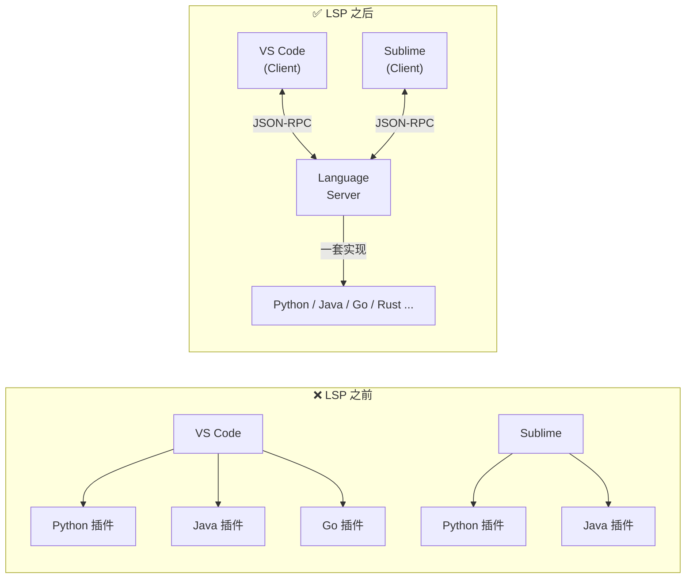

# 深入理解 LSP 协议（Language Server Protocol）

## 前言

Language Server Protocol（LSP）是微软在 2016 年定义的一套开放协议，目的是解决"编辑器与编程语言工具之间的集成"问题。如果你在用 VS Code、Cursor、Trae 等现代 IDE，每一次代码补全、跳转定义、悬停提示，背后都是 LSP 在工作。

对于 TRAE 技术支持岗位而言，LSP 是面试必考题。本文从**问题起源 → 通信原理 → 核心能力 → VS Code 集成**四个层面拆解，读完就能清晰回答面试中的 LSP 相关问题。

---

## 一、LSP 解决了什么问题？

### 1.1 M×N 困境

在 LSP 出现之前，IDE 和编程语言工具的关系是这样的：

```
每种编辑器 × 每种语言 = 单独开发一套插件

VS Code 要支持 Python？→ 写一个 Python 插件
VS Code 要支持 Java？   → 写一个 Java 插件
Sublime 要支持 Python？ → 写一个 Python 插件
Sublime 要支持 Java？   → 写一个 Java 插件
...
```

如果市场上有 **M 种编辑器** 和 **N 种编程语言**，总共需要开发 **M × N** 套集成方案。每套方案都要实现代码补全、跳转定义、错误诊断等相同的能力，只是 API 不同。

### 1.2 LSP 的解耦方案



核心思想：**把语言智能逻辑独立出来，做成一个 Language Server 进程**。

- **编辑器** 只需要实现一次 LSP Client（发送请求、接收结果）
- **语言服务** 也只需实现一次 Language Server（提供补全、诊断等能力）
- 两者通过 LSP 协议通信

> 这就是为什么 VS Code 用了 LSP 之后，新增一种语言支持只需要安装对应的 Language Server，而不是重新写整个插件。

---

## 二、LSP 的通信机制

### 2.1 协议基础：JSON-RPC 2.0

LSP 底层使用 **JSON-RPC 2.0** 作为通信协议。JSON-RPC 是一种轻量级的远程过程调用协议，消息体就是 JSON。

**请求示例：** 编辑器请求"光标处的代码补全"

```json
{
  "jsonrpc": "2.0",
  "id": 1,
  "method": "textDocument/completion",
  "params": {
    "textDocument": { "uri": "file:///home/user/app.py" },
    "position": { "line": 42, "character": 15 }
  }
}
```

**响应示例：** Language Server 返回补全建议列表

```json
{
  "jsonrpc": "2.0",
  "id": 1,
  "result": [
    {
      "label": "calculateTotal",
      "kind": 2,           // 2 = Method
      "detail": "(price: number, qty: number) => number",
      "insertText": "calculateTotal(price, qty)"
    },
    {
      "label": "calculateTax",
      "kind": 2,
      "detail": "(amount: number) => number"
    }
  ]
}
```

### 2.2 三种消息类型

| 类型 | 方向 | 说明 | 示例 |
|------|------|------|------|
| **Request** | Client → Server 或 Server → Client | 需要回复的请求，带 `id` 字段 | `textDocument/completion` |
| **Response** | 对端回复 | 对应某条 Request 的结果 | 返回补全列表或错误 |
| **Notification** | 双向 | 不需要回复的消息，无 `id` 字段 | `textDocument/didOpen`（通知 Server 文件打开了） |

### 2.3 传输通道

LSP 支持两种传输方式：

| 方式 | 场景 | 说明 |
|------|------|------|
| **stdio**（标准输入输出） | 本地 Language Server | 编辑器启动 Server 子进程，通过 `stdin/stdout` 通信。最常见的方式 |
| **TCP / Socket** | 远程 Language Server | 通过网络连接，适用于 Server 和编辑器不在同一台机器上 |

> VS Code 的绝大多数 Language Server 插件使用 stdio 模式：插件启动 Language Server 进程，然后通过管道交换 JSON 消息。

---

## 三、LSP 的核心能力（Features）

LSP 规范定义了以下常用能力，每个都有一个对应的 `method` 名称：

### 3.1 文档同步

| Method | 说明 | 触发时机 |
|--------|------|----------|
| `textDocument/didOpen` | 通知 Server 文件已打开 | 用户打开文件 |
| `textDocument/didChange` | 通知 Server 文件内容变化 | 用户编辑文件 |
| `textDocument/didClose` | 通知 Server 文件已关闭 | 用户关闭文件 |
| `textDocument/didSave` | 通知 Server 文件已保存 | 用户保存文件 |

### 3.2 代码智能（面试高频）

| Method | 说明 | 对应 IDE 功能 |
|--------|------|:---:|
| `textDocument/completion` | 代码补全 | 输入时弹出建议列表 |
| `textDocument/hover` | 悬停信息 | 鼠标悬停显示类型/文档 |
| `textDocument/definition` | 跳转到定义 | `F12` 或 Ctrl+Click |
| `textDocument/references` | 查找所有引用 | `Shift+F12` |
| `textDocument/signatureHelp` | 函数签名提示 | 输入 `(` 时提示参数 |
| `textDocument/rename` | 重命名符号 | `F2` 批量重命名 |
| `textDocument/formatting` | 代码格式化 | `Shift+Alt+F` |
| `textDocument/codeAction` | 快速修复 | 灯泡提示（Quick Fix） |
| `textDocument/documentSymbol` | 文档符号 | 大纲视图 / Breadcrumb |

### 3.3 诊断（错误/警告提示）

| Method | 说明 | 触发时机 |
|--------|------|----------|
| `textDocument/publishDiagnostics` | Server → Client 推送诊断结果 | 文件打开或编辑后即时发送 |

> ⚠️ 注意：诊断是 **Server 主动推送**（Notification），不是 Client 请求。Server 分析完代码后直接把错误列表推给编辑器。

---

## 四、VS Code + LSP：插件在做什么？

### 4.1 架构全景

```
┌──────────────────────────────────────────────────┐
│                    VS Code 主进程                   │
│                                                    │
│  ┌──────────────┐         ┌────────────────────┐  │
│  │   UI 渲染层    │         │  Extension Host    │  │
│  │   (Electron)  │         │  (独立 Node 进程)    │  │
│  │               │         │                    │  │
│  │  用户输入     │  ◄───►  │  LSP Client 部分    │  │
│  │  显示结果     │   API   │  (vscode.languages) │  │
│  └──────────────┘         └────────┬───────────┘  │
│                                    │               │
└────────────────────────────────────┼───────────────┘
                                     │ JSON-RPC
                                     │ (stdio / TCP)
                          ┌──────────▼───────────┐
                          │   Language Server     │
                          │   (独立进程)           │
                          │                       │
                          │   解析 AST             │
                          │   类型检查             │
                          │   代码分析             │
                          │   生成补全建议          │
                          └───────────────────────┘
```

### 4.2 三个关键流程

**流程一：打开文件**

```
用户打开 app.ts
  → VS Code 发送 textDocument/didOpen（文件内容 + URI）
  → Language Server 解析 AST、建立索引、执行静态分析
  → Server 推送 textDocument/publishDiagnostics（错误/警告列表）
  → VS Code 在编辑器中显示红色波浪线
```

**流程二：输入代码**

```
用户输入 "obj."
  → VS Code 发送 textDocument/completion（光标位置）
  → Language Server 分析 obj 的类型，提取可用属性/方法
  → Server 返回补全列表 [{ label: "name" }, { label: "getId()" }]
  → VS Code 弹出下拉建议框
```

**流程三：跳转定义**

```
用户 Ctrl+Click "calculateTotal"
  → VS Code 发送 textDocument/definition（符号名 + 位置）
  → Language Server 在索引中查找符号定义的文件和行列号
  → Server 返回 { uri: "file:///src/utils.ts", range: { line: 23, character: 4 } }
  → VS Code 打开对应文件并跳转到该位置
```

---

## 五、为什么 AI IDE 时代 LSP 更重要

### 5.1 AI IDE 对 LSP 的依赖

Cursor、Trae 等 AI IDE 的分析能力很大程度上依赖 LSP：

| AI IDE 功能 | LSP 提供了什么 |
|-------------|---------------|
| AI 理解你的代码意图 | 通过 `documentSymbol` 获取代码结构、通过 `references` 了解模块间调用关系 |
| AI 精准修改 | 通过 `definition` 定位修改点、通过 `diagnostics` 验证修改后无新错误 |
| 上下文感知补全 | LSP 的符号索引 + 类型信息作为 AI 提示词的上下文 |
| 跨文件重构 | `rename` + `references` 保证重命名一致性 |

> 简单说：LSP 是 AI IDE 的"眼睛"——AI 通过 LSP 来理解你的代码库结构。

### 5.2 排障视角：LSP 相关常见问题

作为技术支持，你可能会遇到这些 LSP 相关的用户反馈：

| 用户反馈 | 可能原因 | 排查方向 |
|----------|---------|----------|
| "补全不出来" | Language Server 未启动或崩溃 | 检查 Server 进程是否存活、日志有无报错 |
| "跳转定义跳不准" | 索引不完整或项目未正确配置 | 检查 `tsconfig.json`/`pom.xml` 是否正确、重建索引 |
| "红色波浪线乱报" | Server 版本与项目 SDK 不匹配 | 检查语言版本（如 Python 3.12 vs 3.8）、更新 Server |
| "AI 功能卡顿" | LSP Server 在后台做全量分析 | 大项目初开时正常，观察是否持续超过 5 分钟 |

---

## 六、面试回答模板

### 问题：请简单解释一下 LSP 协议，它解决了什么问题？

> 💡 **30 秒回答：**
>
> LSP 是微软定义的基于 JSON-RPC 的协议，核心思想是将"编辑器的 UI"和"语言分析能力"解耦。
>
> 它解决的痛点是 M×N 问题——以前每种编辑器都要为每种语言单独开发补全/跳转/诊断插件，有了 LSP 后，语言开发者只需写一个 Language Server，所有支持 LSP 的编辑器都能复用。
>
> 通信方式是 JSON-RPC over stdio 或 TCP，编辑器作为 Client 发请求（如 `textDocument/completion`），Language Server 返回结果。支持的常用能力包括代码补全、跳转定义、查找引用、错误诊断、代码格式化等。这也是 Cursor、Trae 等 AI IDE 理解代码库的底层基础设施。

### 问题：用户反馈 TRAE 代码补全不工作，你怎么排查？

> 💡 **回答框架：**
>
> 先用排障 SOP 五步法：
>
> 1. **确认现象**：是所有文件都不补全，还是特定文件/语言？是所有项目还是某一个项目？
> 2. **看日志**：打开开发者工具（Help → Toggle Developer Tools），筛选 Language Server 相关日志，看是否有启动失败或报超时
> 3. **隔离变量**：禁用其他插件 → 重新加载窗口 → 检查是否是插件冲突。换一个同语言的小项目试，排除项目配置问题
> 4. **查环境**：检查对应语言的 SDK（Node/Python/Java）是否正确安装、版本是否被 LSP Server 支持
> 5. **提报**：如果都排除了，收集日志 + 复现步骤，提内部工单

---

## 参考资料

- [LSP 官方规范](https://microsoft.github.io/language-server-protocol/specifications/lsp/3.17/specification/)
- [LSP Overview](https://microsoft.github.io/language-server-protocol/overviews/lsp/overview/)
- [VS Code Extension API - Language Extensions](https://code.visualstudio.com/api/language-extensions/overview)
