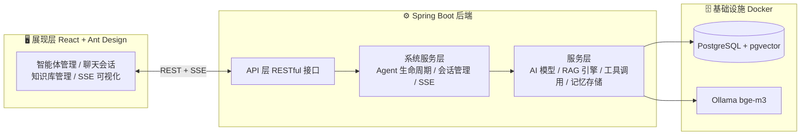
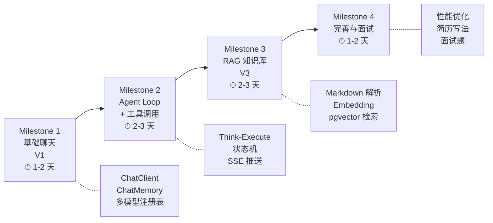
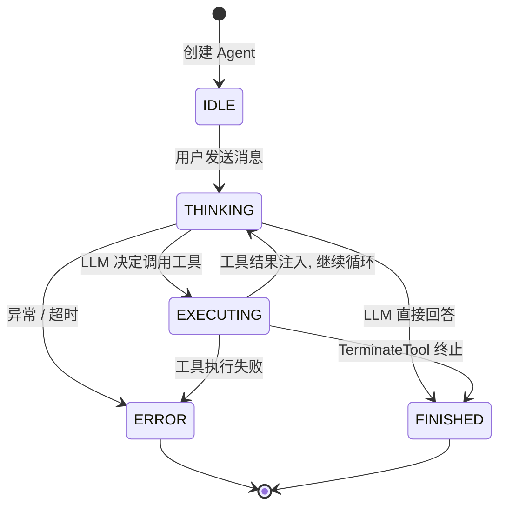
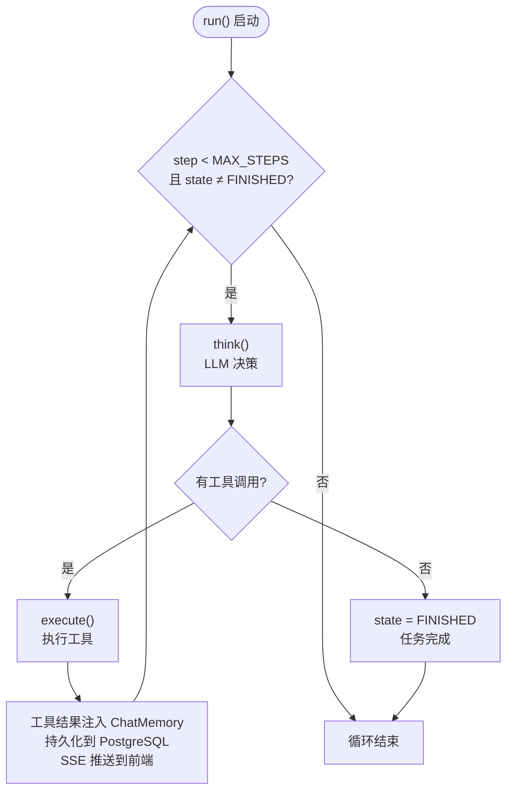
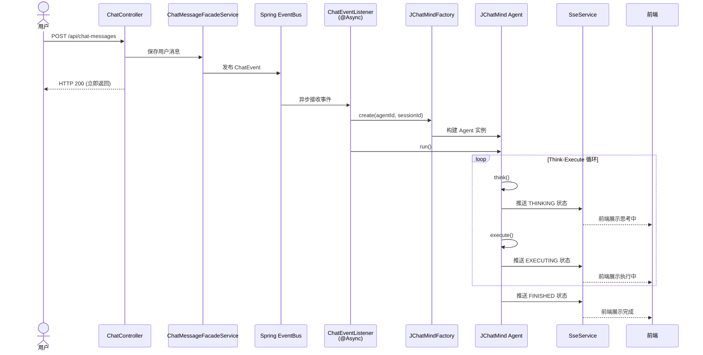
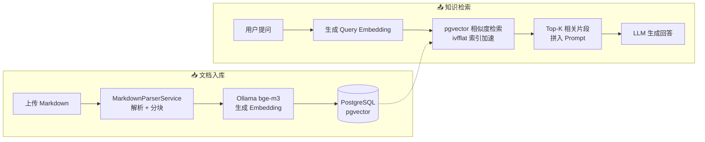
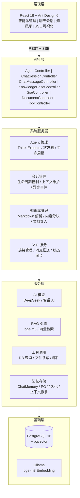

# JChatMind：从零搭建一个面试级 AI Agent 智能体平台

> 基于 Spring AI + React 的 AI Agent 个人项目，涵盖 Agent Loop 自主决策、工具调用、RAG 知识库检索、SSE 实时推送。
> 本文从**最小可运行原型**出发，逐步叠加功能模块，完整呈现一个 AI Agent 项目的技术全貌。

## 一、项目简介

JChatMind 是一个智能 AI Agent 系统，基于 **Spring AI** 框架构建，实现了自主决策、工具调用和知识库检索等核心能力。

**它不是"聊天机器人"，而是 Agent**：能规划、能调用工具、能检索知识库、还能把执行过程实时推给前端。

做完它之后，面试官再问 AI 项目，你能讲的不是"我接了个接口"，而是：

- 我实现了 **Think-Execute 循环**（ReAct 模式自主决策）
- 我设计了 **可扩展工具调用框架**（固定工具 + 可选工具 + 手动接管 Spring AI）
- 我实现了 **RAG 全链路**（Markdown 解析 → 分块 → Embedding → pgvector 检索）
- 我构建了 **多模型注册表模式**（DeepSeek / 智谱 GLM-4.6 动态切换）
- 我实现了 **SSE 实时推送**（Agent 执行状态可视化）
- 我完成了 **事件驱动的异步执行架构**（ChatEvent → @Async → Agent Loop）

**技术栈**：

| 层级 | 技术 | 说明 |
|------|------|------|
| 后端框架 | Spring Boot 3.5 | 应用框架 |
| AI 框架 | Spring AI 1.1 | LLM 集成、ChatClient、Tool Calling、ChatMemory |
| 数据库 | PostgreSQL 16 + pgvector | 业务数据 + 向量检索（RAG） |
| ORM | MyBatis 3.0 | 持久层，含自定义 TypeHandler |
| 嵌入模型 | Ollama + bge-m3 | 本地 Embedding（RAG 用） |
| LLM | DeepSeek / 智谱 GLM-4.6 | 大语言模型（API Key 配置） |
| 实时通信 | SSE | 服务端推送 Agent 状态 |
| 前端 | React 19 + Vite 7 + Ant Design 6 | 前端界面 |
| 容器化 | Docker + Compose | PostgreSQL + Ollama 一键启动 |

**项目地址**：[https://github.com/youngyangyang04/JChatMind](https://github.com/youngyangyang04/JChatMind)

### 项目全景图



## 二、开发路线：从最小原型到完整项目

这个项目适合**渐进式开发**，分四个里程碑完成：



### Milestone 1：基础聊天（ChatClient + ChatMemory）

**目标**：打通 LLM 调用链路，实现有记忆的对话。

**技术点**：
- Spring AI `ChatClient` 集成 DeepSeek / 智谱
- `MessageWindowChatMemory` 滑动窗口记忆
- `SystemMessage` 系统提示词注入
- `ChatClientRegistry` 注册表模式管理多模型

**关键代码**：

```java
// 多模型 Bean 注册
@Bean("deepseek-chat")
public ChatClient deepSeekChatClient(DeepSeekChatModel model) {
    return ChatClient.create(model);
}

// 注册表模式
@Component
public class ChatClientRegistry {
    private final Map<String, ChatClient> chatClients;
    public ChatClient get(String key) { return chatClients.get(key); }
}
```

### Milestone 2：Agent Loop + 工具调用

**目标**：让 Agent 能自主决策、调用工具完成任务。

**技术点**：
- Think-Execute 循环（ReAct 模式），最多 20 步
- 状态机管理：`IDLE → THINKING → EXECUTING → FINISHED`
- 固定工具（TerminateTool）+ 可选工具（DataBaseTools）
- **手动接管** Spring AI 的 `internalToolExecutionEnabled = false`
- `ToolCallingManager` 显式执行工具调用
- 工具结果注入 `ChatMemory` + 持久化到 PostgreSQL
- SSE 实时推送 Agent 每一步状态

**Agent 状态机**：



**核心循环**：



**对应代码**：

```java
// JChatMind.java
public void run() {
    for (int i = 0; i < MAX_STEPS && agentState != FINISHED; i++) {
        step();  // think() → execute()
    }
}

private void step() {
    if (think()) {       // LLM 决定：直接回答 or 调用工具？
        execute();       // 执行工具，结果注入上下文，循环继续
    } else {
        agentState = FINISHED;  // 无工具调用 = 任务结束
    }
}
```

**工具接口设计**：

```java
public interface Tool {
    String getName();          // 工具唯一标识
    String getDescription();   // 给 LLM 看的描述
    ToolType getType();        // FIXED（强制）| OPTIONAL（可选）
}
```

**事件驱动异步架构**：



### Milestone 3：RAG 知识库检索

**目标**：Agent 能从私有知识库中检索信息，结合 LLM 回答。这是从"能聊天"到"企业级应用"的关键一步。

**技术栈**：

| 组件 | 用途 |
|------|------|
| PostgreSQL + pgvector | 向量存储与相似度检索 |
| Ollama + bge-m3 | 本地 Embedding 模型（1.2GB） |
| flexmark | Markdown 文档解析与分块 |
| ivfflat 索引 | 加速向量检索，支持 10 万+ 向量 |

**全链路流程**：



**为什么选 PostgreSQL + pgvector？** 一套数据库管理结构化和向量数据，部署简单，事务一致性，ivfflat 索引优化后 10 万级向量检索毫秒级响应。

### Milestone 4：完善与面试准备

**目标**：打磨项目细节，准备面试话术。

**可扩展的工具生态**：

| 工具 | 类型 | 功能 |
|------|------|------|
| `TerminateTool` | FIXED | 结束 Agent 任务 |
| `DataBaseTools` | OPTIONAL | 执行 PostgreSQL SELECT 查询 |
| `KnowledgeTools` | FIXED | 触发 RAG 知识库检索 |
| `EmailTools` | OPTIONAL | 异步发送邮件 |
| `FileSystemTools` | OPTIONAL | 读写文件系统 |
| `WeatherTool` | — | 天气查询（演示用） |

**性能指标**：响应 < 2s、并发 100+、RAG 准确率 85%+

## 三、项目架构



**分层职责**：

| 层 | 职责 | 关键技术 |
|----|------|---------|
| **展现层** | 用户交互、SSE 状态可视化 | React + Ant Design + EventSource |
| **API 层** | RESTful 接口，屏蔽内部复杂度 | Spring MVC + 统一 ApiResponse |
| **系统服务层** | Agent 生命周期、会话管理、知识库、SSE | 事件驱动 + 异步执行 |
| **服务层** | AI 模型调用、RAG 检索、工具执行、记忆存储 | Spring AI + pgvector + MyBatis |
| **基础层** | 数据持久化、向量存储、本地模型 | Docker + PostgreSQL + Ollama |

## 四、数据模型

```sql
-- 智能体配置表
CREATE TABLE agent (
    id UUID PRIMARY KEY DEFAULT uuid_generate_v4(),
    name VARCHAR(255) NOT NULL,
    description TEXT,
    system_prompt TEXT,
    model VARCHAR(100) DEFAULT 'deepseek-chat',
    allowed_tools JSONB DEFAULT '[]',
    allowed_kbs JSONB DEFAULT '[]',
    chat_options JSONB DEFAULT '{"temperature":0.7,"topP":1.0,"messageLength":10}',
    created_at TIMESTAMP DEFAULT NOW(),
    updated_at TIMESTAMP DEFAULT NOW()
);

-- 聊天会话表
CREATE TABLE chat_session (
    id UUID PRIMARY KEY DEFAULT uuid_generate_v4(),
    agent_id UUID REFERENCES agent(id) ON DELETE CASCADE,
    title VARCHAR(255),
    metadata JSONB DEFAULT '{}',
    created_at TIMESTAMP DEFAULT NOW(),
    updated_at TIMESTAMP DEFAULT NOW()
);

-- 聊天消息表
CREATE TABLE chat_message (
    id UUID PRIMARY KEY DEFAULT uuid_generate_v4(),
    session_id UUID REFERENCES chat_session(id) ON DELETE CASCADE,
    role VARCHAR(20) NOT NULL,
    content TEXT,
    metadata JSONB DEFAULT '{}',
    created_at TIMESTAMP DEFAULT NOW(),
    updated_at TIMESTAMP DEFAULT NOW()
);

-- 知识库表
CREATE TABLE knowledge_base (
    id UUID PRIMARY KEY DEFAULT uuid_generate_v4(),
    name VARCHAR(255) NOT NULL,
    description TEXT,
    created_at TIMESTAMP DEFAULT NOW(),
    updated_at TIMESTAMP DEFAULT NOW()
);

-- 文档分块 + 向量表
CREATE TABLE chunk_bge_m3 (
    id UUID PRIMARY KEY DEFAULT uuid_generate_v4(),
    doc_id UUID REFERENCES document(id) ON DELETE CASCADE,
    content TEXT,
    embedding vector(1024),
    created_at TIMESTAMP DEFAULT NOW()
);
CREATE INDEX ON chunk_bge_m3 USING ivfflat (embedding vector_cosine_ops);
```

## 五、快速开始

### 前置条件

| 工具 | 版本 |
|------|------|
| JDK | 17+ |
| Maven | 3.6+ |
| Node.js | 22+ |
| Docker Desktop | 最新版 |

### 环境搭建

**第 1 步 — 拉取代码**

```bash
git clone https://github.com/youngyangyang04/JChatMind.git
cd JChatMind
```

**第 2 步 — 启动 Docker 基础设施**

```bash
cd TEMP/docker/jchatmind
docker compose up -d postgres               # 最小原型（仅 PostgreSQL）
docker compose up -d                        # 完整项目（PostgreSQL + Ollama）
docker exec -it jchatmind-ollama ollama pull bge-m3
```

**第 3 步 — 配置 API Key**

编辑 `jchatmind/src/main/resources/application.yaml`：

```yaml
spring:
  datasource:
    url: jdbc:postgresql://localhost:15432/jchatmind
    username: jchatmind
    password: jchatmind123
  ai:
    deepseek:
      api-key: sk-your-key-here
```

**第 4 步 — 启动后端**

```bash
cd jchatmind
./mvnw spring-boot:run
```

验证：`curl http://localhost:8080/api/agents` → 返回 `{"code":200,...}`

**第 5 步 — 启动前端**

```bash
cd ui
npm install
npm run dev
```

访问 `http://127.0.0.1:15173/`。

## 六、项目亮点

### 1. 真正的 Agent Loop（Think-Execute 循环 + 状态机）

不是"调用一次大模型就结束"，而是支持：

- 多轮规划
- 多轮工具调用
- 状态管理（THINKING / EXECUTING / DONE / ERROR）
- 错误处理与最大步数控制（防止无限循环）

**面试点**：「怎么避免 Agent 无限调用工具？怎么做状态管理？怎么做超时控制？」

### 2. 工具系统（可扩展、可治理）

很多人做工具调用只是"写几个 if else"，JChatMind 的工具系统是"框架化"的：

- 工具自动注册
- 固定工具 / 可选工具分类管理
- 可扩展：新增工具不改核心流程
- 可控：禁用 Spring AI 自动执行，改为手动管理 ToolCalling 流程

**面试点**：「工具调用怎么做扩展？工具失败怎么处理？工具返回结果怎么进入对话历史？」

### 3. RAG 知识库（PostgreSQL + pgvector）

RAG 不是 PPT 概念，JChatMind 是完整链路：

- Markdown 文档解析、分块
- Embedding 生成并落库
- pgvector 相似度检索（`<->`）
- ivfflat 索引优化，支持 10 万+向量

最关键的是：用 PostgreSQL 一套体系把结构化数据和向量数据都管了（部署简单、成本低、事务一致性好）。

### 4. 多模型支持（注册表模式 ChatClientRegistry）

项目不是"绑定一个模型"，而是：

- DeepSeek / 智谱 AI 可切换
- 统一 ChatClient 接口
- 注册表模式管理模型实例（解耦创建与使用）
- 便于未来扩展更多模型

**面试点**：「如果要加一个新模型要改哪些代码？怎么做到无侵入？」

### 5. SSE 实时通信（执行过程实时可视化）

很多 Agent 项目体验很差：用户不知道系统在干嘛。JChatMind 用 SSE 做了：

- 状态实时推送：THINKING / EXECUTING / DONE
- 前端能实时看到"Agent 正在干啥"
- 比 WebSocket 更简单，适合单向推送

**面试点**：「SSE 和 WebSocket 区别？连接怎么管理？超时怎么处理？并发怎么扛？」

## 七、面试怎么说

### 1 分钟自我介绍模板

> "我做过一个 AI Agent 智能体项目 JChatMind，基于 Spring AI + React 构建。核心是 Think-Execute 循环的自主决策引擎，大模型在每一步自主决定是直接回答还是调用工具。工具系统采用接口化设计，分固定工具和可选工具，新增工具不碰核心代码。系统通过 SSE 实时推送 Agent 的思考和执行状态到前端，采用事件驱动架构在异步线程中运行，不阻塞 HTTP 响应。在多模型支持上，用注册表模式实现 DeepSeek 和智谱的动态切换。项目还集成了 RAG 知识库检索，基于 PostgreSQL pgvector 做向量相似度搜索。"

### 常见追问速答

**Q: Agent Loop 怎么防止无限循环？**

> 三个机制：(1) 硬限制 MAX_STEPS = 20；(2) TerminateTool 让 LLM 主动终止；(3) 每步检查 agentState 状态机。

**Q: 工具调用怎么扩展？**

> 实现 Tool 接口 → @Component 自动注册 → ToolFacadeService 按 FIXED/OPTIONAL 分类 → Agent 配置中勾选即可。新增工具不修改 JChatMind.java 核心代码。

**Q: 为什么不用 Spring AI 的自动工具执行？**

> 需要手控三个关键步骤：工具结果注入 ChatMemory（影响后续对话）、SSE 推送到前端（用户体验）、持久化到 PostgreSQL（审计和恢复）。自动执行会跳过这些。

**Q: RAG 为什么选 pgvector 而不是专用向量数据库？**

> 部署简单（一套 PG 搞定）、事务一致（知识和向量在同一个事务）、成本低。ivfflat 索引优化后 10 万级向量响应毫秒级。

**Q: SSE 和 WebSocket 怎么选？**

> Agent 执行是服务端单向推送状态，客户端只需接收。SSE 基于 HTTP，实现简单，EventSource API 浏览器原生支持。

## 八、学习收获

| 层面 | 你学到了什么 |
|------|-------------|
| **理论** | ReAct 模式、状态机、滑动窗口记忆、向量相似度检索 |
| **设计** | 注册表模式、事件驱动、分层解耦、工具接口化 |
| **工程** | Spring AI、MyBatis、SSE、pgvector、Docker Compose |
| **面试** | Agent Loop 终止条件、工具扩展性、RAG 技术选型理由 |

当面试官问「你的 Agent 和普通聊天机器人有什么区别」时，你能从架构图一路讲到代码细节——这就是项目经验的核心价值。

> **项目地址**：[https://github.com/youngyangyang04/JChatMind](https://github.com/youngyangyang04/JChatMind)
> **项目介绍**：[语雀文档](https://www.yuque.com/chengxuyuancarl/zsqzgh/vgz89f5luxn4c5h9)

---

*本文基于 JChatMind 官方文档与源码整理，持续更新中。*
