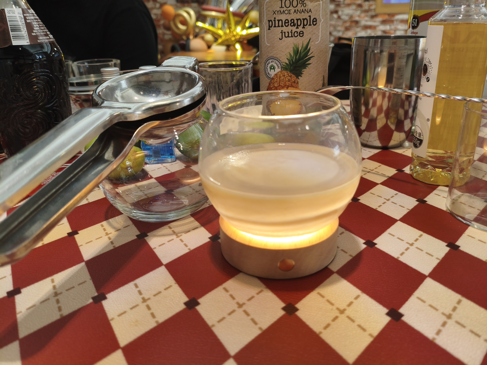

```haskell
record DrinkMenu where
	constructor MkDrinkMenu
	spiritIngredients : List String
	allIngredients    : List String

mySunshineCloudMenu : DrinkMenu
mySunshineCloudMenu = MkDrinkMenu
	["伏特加", "波本威士忌"]
	["伏特加", "可可利口酒", "波本威士忌", "全脂牛奶"]

```

# <span style="color:#F4A460; font-weight:bold;">Sunshine Cloud</span>


## **配料：**
```markdown
伏特加 1.5 oz
可可利口酒 1 oz
波本威士忌 1 oz
苦精 3酹
全脂牛奶 2.5 oz
```


## **制作步骤：**
```markdown
1. 将所有配料放入装满冰块的摇壶中。
2. 盖上摇壶用力摇和。
3. 将酒液和冰块一起倒入杯中。
```



