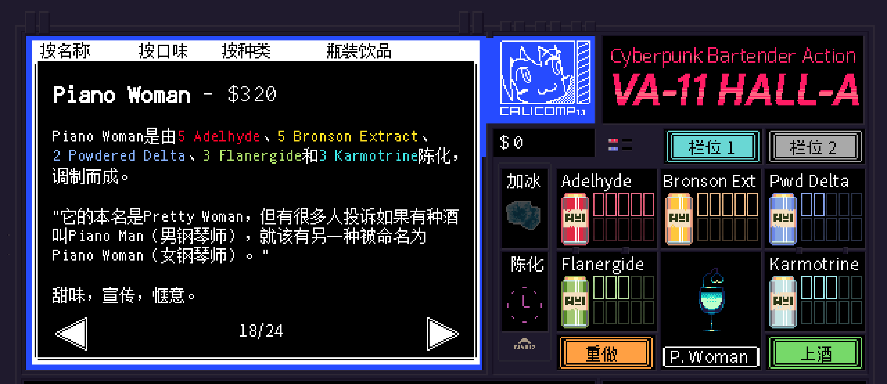

```haskell
record DrinkMenu where
	constructor MkDrinkMenu
	spiritIngredients : List String
	allIngredients    : List String

myPianoWomanMenu : DrinkMenu
myPianoWomanMenu = MkDrinkMenu
	["黑朗姆酒", "蓝橙利口酒", "紫罗兰利口酒"]
	["黑朗姆酒", "蓝橙利口酒", "紫罗兰利口酒", "单一糖浆", "青柠汁", "汤力水"]

```

# <span style="color:#3A6EA5; font-weight:bold;">Piano Woman</span>


## **配料：**
```markdown
黑朗姆酒 0.75 oz
蓝橙利口酒 0.5 oz
紫罗兰利口酒 0.5 oz
单一糖浆 0.75 oz
青柠汁 0.5 oz
汤力水 1 oz
```


## **制作步骤：**
```markdown
1. 将除汤力水外的所有配料放入装满冰块的摇壶中。
2. 盖上摇壶用力摇和，然后过滤到玻璃杯中；如有需要，可以加入摇壶中的冰块。
3. 加入1.5盎司汤力水，搅拌均匀。
```


