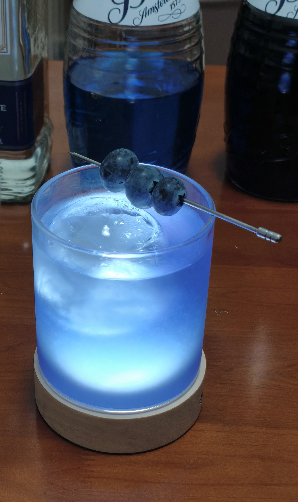

# <span style="color:#5CA9E6; font-weight:bold;">Piano Man</span>


```haskell
record DrinkMenu where
	constructor MkDrinkMenu
	spiritIngredients : List String
	allIngredients    : List String

myPianoManMenu : DrinkMenu
myPianoManMenu = MkDrinkMenu
	["龙舌兰", "蓝橙利口酒", "紫罗兰利口酒"]
	["龙舌兰", "蓝橙利口酒", "紫罗兰利口酒", "单一糖浆", "青柠汁", "水"]

```


## **配料：**
```markdown
龙舌兰 1.25 oz
蓝橙利口酒 0.25 oz
紫罗兰利口酒 1 oz
单一糖浆 0.5 oz
青柠汁 1 oz
水 0.5 oz
```


## **制作步骤：**
```markdown
1. 将所有配料放入装满冰块的摇壶中。
2. 盖上摇壶用力摇和。
3. 将过滤的酒液倒入玻璃杯中；如有需要，可以加入摇壶中的冰块。
4. 用一串蓝莓装饰杯边。
```


