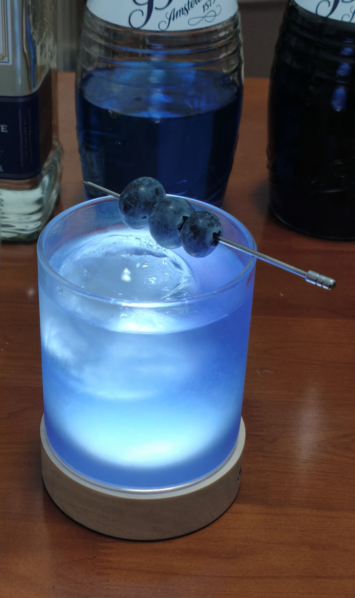

# <span style="color:#5CA9E6; font-weight:bold;">Piano Man</span>

口味：酸味        类型：宣传、强烈        调制方式：加冰、调和

## **配料：**

龙舌兰 1.25盎司        蓝橙利口酒 0.25盎司        紫罗兰利口酒 1盎司

单一糖浆 0.5盎司        青柠汁 1盎司        水 0.5盎司

## **制作步骤：**

1 将所有配料放入装满冰块的摇壶中。

2 盖上摇壶用力摇和。

3 将过滤的酒液倒入玻璃杯中；如有需要，可以加入摇壶中的冰块。

4 用一串蓝莓装饰杯边。


```haskell
record DrinkMenu where
	constructor MkDrinkMenu
	spiritIngredients : List String
	allIngredients    : List String

myPianoManMenu : DrinkMenu
myPianoManMenu = MkDrinkMenu
	["龙舌兰", "蓝橙利口酒", "紫罗兰利口酒"]
	["龙舌兰", "蓝橙利口酒", "紫罗兰利口酒", "单一糖浆", "青柠汁", "水"]

```



