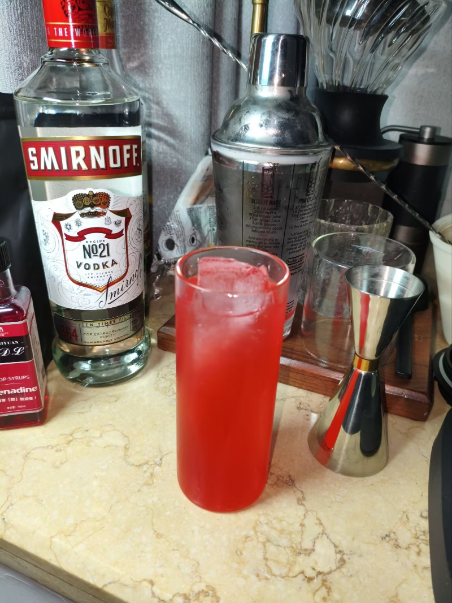

# <span style="color:#E75480">Sugar Rush</span>


**配料：**

伏特加 1.5盎司        单一糖浆 1盎司        石榴汁 0.5盎司        菠萝汁 0.5盎司

**制作步骤：**

1 将除汤力水外的所有配料放入装满冰块的摇壶中；无酒精版在这一步中无需放入苏打水。

2 盖上摇壶用力摇和。

3 将过滤的酒液倒入玻璃杯中；如有需要，可以加入摇壶中的冰块；无酒精版在这一步加入苏打水并搅拌均匀。

**无酒精版**

单一糖浆 1盎司        石榴汁 0.5盎司        菠萝汁 0.5盎司        天然含气矿泉水 2盎司


```haskell
record DrinkMenu where
	constructor MkDrinkMenu
	spiritIngredients : List String
	allIngredients    : List String

mySugarRushMenu : DrinkMenu
mySugarRushMenu = MkDrinkMenu
	["伏特加"]
	["伏特加", "单一糖浆", "石榴汁", "菠萝汁", "天然含气矿泉水"]

```



