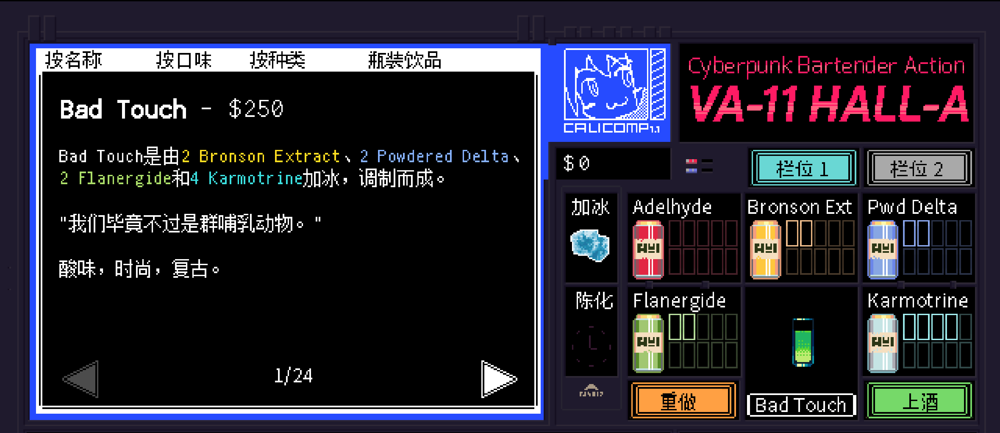

# <span style="color:#32CD99; font-weight:bold;">Bad Touch</span>


**配料：**

金酒 1盎司        潘诺酒 0.5盎司        蓝橙利口酒 少许        单一糖浆 0.25盎司

青柠汁 0.5盎司        橙汁 0.75盎司        汤力水 1.5盎司

**制作步骤：**

1 将除汤力水外的所有配料放入装满冰块的摇壶中。

2 盖上摇壶用力摇和，然后过滤到玻璃杯中；如有需要，可以加入摇壶中的冰块。

3 加入1.5盎司汤力水，搅拌均匀。

```haskell
record DrinkMenu where
	constructor MkDrinkMenu
	spiritIngredients : List String
	allIngredients    : List String

myBadTouchMenu : DrinkMenu
myBadTouchMenu = MkDrinkMenu
	["金酒", "潘诺酒", "蓝橙利口酒"]
	["金酒", "潘诺酒", "蓝橙利口酒", "单一糖浆", "青柠汁", "橙汁", "汤力水"]

```


