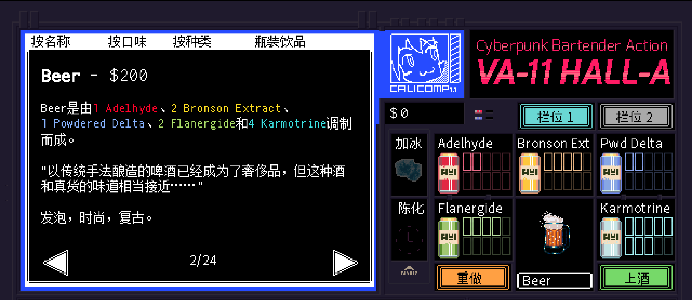

# <span style="color:#FBB117; font-weight:bold;">Beer</span>

口味：发泡        类型：经典、复古        调制方式：调和

**配料：**

啤酒花风味威士忌 1盎司        普罗塞科起泡酒 4盎司        麦芽苏打水 2盎司

**制作步骤：**

1 将所有配料放入装满冰块的玻璃杯中。 

2 轻轻搅拌均匀。

```haskell
record DrinkMenu where
	constructor MkDrinkMenu
	spiritIngredients : List String
	allIngredients    : List String

myBeerMenu : DrinkMenu
myBeerMenu = MkDrinkMenu
	["啤酒花风味威士忌"]
	["啤酒花风味威士忌", "普罗塞科起泡酒", "麦芽苏打水"]

```


