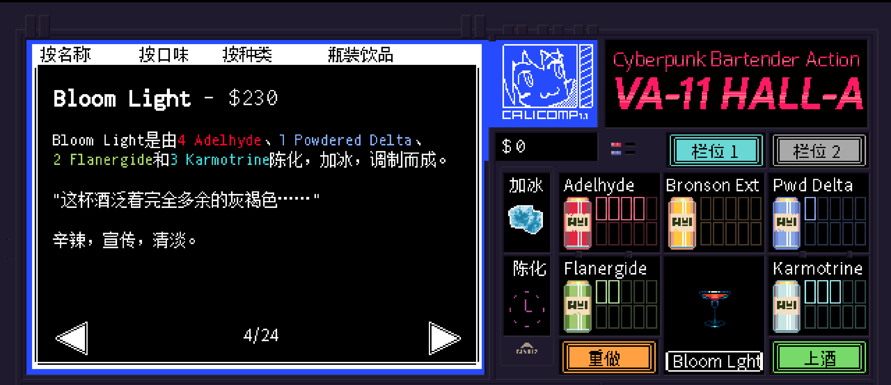

# <span style="color:#E2A76F; font-weight:bold;">Bloom Light</span>

口味：辛辣        类型：宣传、清淡        调制方式：加冰、陈化、调和

**配料：**

肉桂威士忌 1.5盎司        朗姆奶油利口酒 1.5盎司        麦芽苏打水 1.5盎司

**制作步骤：**

1 将肉桂威士忌和朗姆奶油利口酒放入装满冰块的摇壶中。

2 盖好摇壶用力摇和，之后将酒液和冰块一起倒入杯中。

3 倒入麦芽苏打水，轻轻搅拌均匀。

```haskell
record DrinkMenu where
	constructor MkDrinkMenu
	spiritIngredients : List String
	allIngredients    : List String

myBloomLightMenu : DrinkMenu
myBloomLightMenu = MkDrinkMenu
	["肉桂威士忌"]
	["肉桂威士忌", "朗姆奶油利口酒", "麦芽苏打水"]

```


