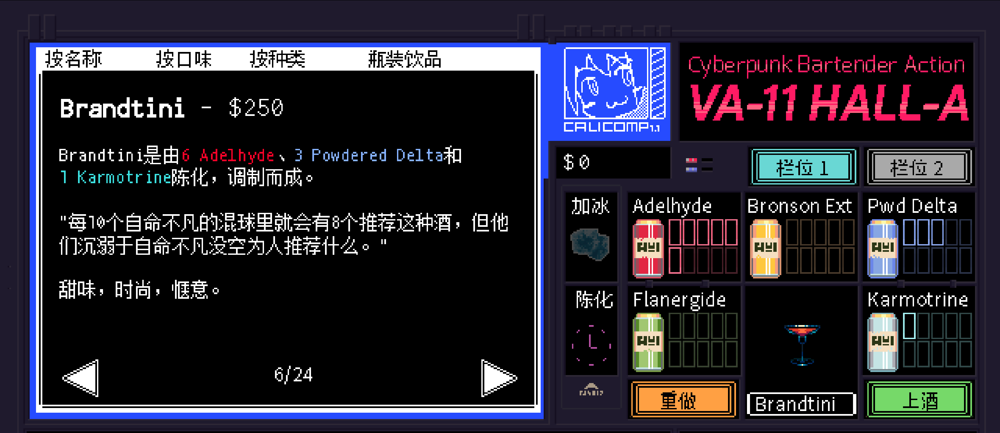

# <span style="color:#DC143C; font-weight:bold;">Brandtini</span>

口味：甜味        类型：时尚、惬意        调制方式：陈化、调和

**配料：**

伏特加 0.75盎司        金酒 0.75盎司        橙味利口酒 0.5盎司        单一糖浆 0.5盎司

青柠汁 0.75盎司        橙汁 0.75盎司        蔓越莓汁 2盎司

**制作步骤：**

1 将所有配料放入装满冰块的摇壶中。

2 盖上摇壶用力摇和。

3 将过滤的酒液倒入玻璃杯中，玻璃杯越漂亮酒就越好喝。 ;)

```haskell
record DrinkMenu where
	constructor MkDrinkMenu
	spiritIngredients : List String
	allIngredients    : List String

myBrandtiniMenu : DrinkMenu
myBrandtiniMenu = MkDrinkMenu
	["伏特加", "金酒", "橙味利口酒"]
	["伏特加", "金酒", "橙味利口酒", "单一糖浆", "青柠汁", "橙汁", "蔓越莓汁"]

```


