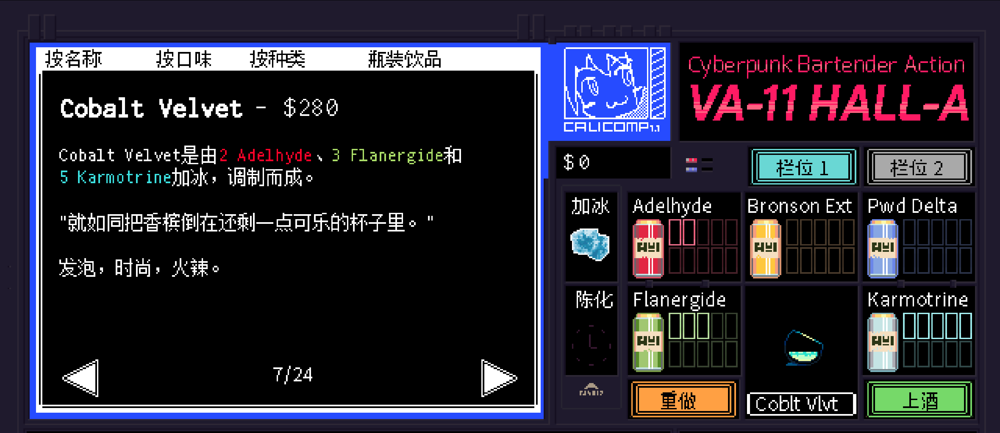

# <span style="color:#40E0D0; font-weight:bold;">Cobalt Velvet</span>

口味：发泡        类型：时尚、火辣        调制方式：加冰、调和

**配料：**

金酒 1.5盎司        青柠汁 0.25盎司        普罗塞科起泡酒 2盎司

伏特牌苏打水 2盎司        可乐 少许

**制作步骤：**

1 将金酒和青柠汁放入装满冰块的摇壶中。

2 盖上摇壶用力摇和。

3 将过滤的酒液倒入玻璃杯中；如有需要，可以加入摇壶中的冰块。

4 放入其余配料，搅拌均匀。

```haskell
record DrinkMenu where
	constructor MkDrinkMenu
	spiritIngredients : List String
	allIngredients    : List String

myCobaltVelvetMenu : DrinkMenu
myCobaltVelvetMenu = MkDrinkMenu
	["金酒"]
	["金酒", "青柠汁", "普罗塞科起泡酒", "伏特牌苏打水", "可乐"]

```


