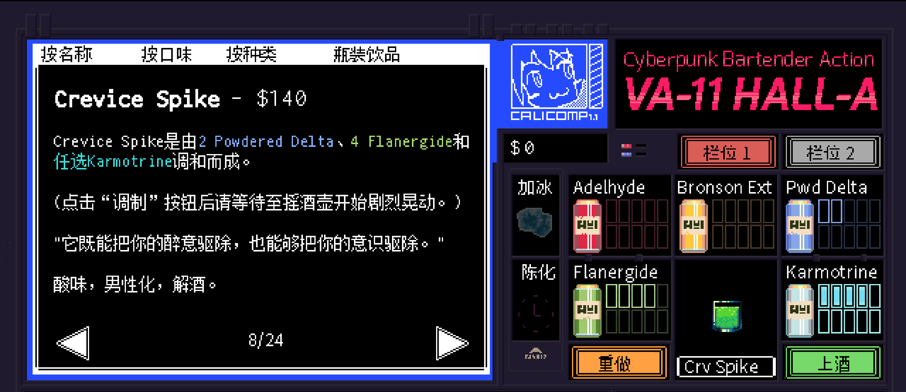

# <span style="color:#66CDAA; font-weight:bold;">Crevice Spike</span>


**配料：**

白朗姆酒 1盎司        蜜瓜利口酒 2盎司        柠檬汁 1盎司

青柠汁 1盎司        姜汁啤酒 1盎司        辣酱 少许

**制作步骤：**

1 将前四种配料放入装满冰块的摇壶中；盖上摇壶用力摇和。

2 在玻璃杯底部加入少许辣酱；将过滤的酒液倒入玻璃杯中，如有需要，可以加入摇壶中的冰块；最后倒入姜汁啤酒，轻轻搅拌均匀。

3 无酒精版最好在装满冰块的玻璃杯中直接搅拌混合。


**无酒精版**

蜜瓜苏打 2盎司        青柠汁 1盎司        姜汁啤酒 1.5盎司

水 1盎司        柠檬汁 1盎司        辣酱 少许

```haskell
record DrinkMenu where
	constructor MkDrinkMenu
	spiritIngredients : List String
	allIngredients    : List String

myCreviceSpikeMenu : DrinkMenu
myCreviceSpikeMenu = MkDrinkMenu
	["白朗姆酒", "蜜瓜利口酒", "姜汁啤酒"]
	["白朗姆酒", "蜜瓜利口酒", "柠檬汁", "青柠汁", "姜汁啤酒", "辣酱", "蜜瓜苏打", "水"]

```


