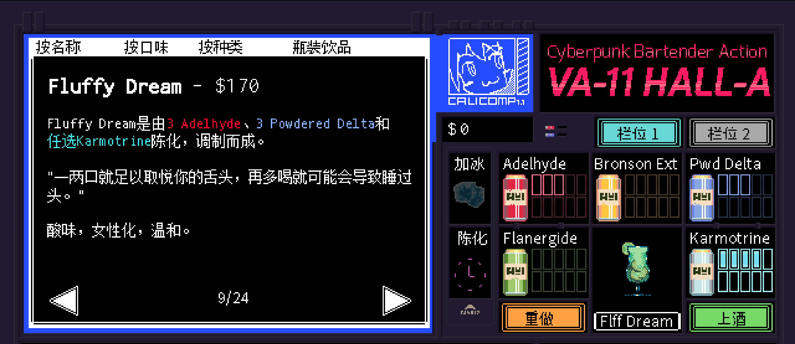

# <span style="color:#B0E57C; font-weight:bold;">Fluffy Dream</span>

口味：酸味        类型：女性化、温和        调制方式：陈化、调和

**配料：**

白朗姆酒 1盎司        蓝橙利口酒 少许        蜜瓜利口酒 0.5盎司

天鹅绒法勒纳姆利口酒 0.5盎司        单一糖浆 0.5盎司        青柠汁 1盎司        菠萝汁 1盎司

**制作步骤：**

1 将所有配料放入装满冰块的摇壶中。

2 盖上摇壶用力摇和；将过滤的酒液倒入玻璃杯中，如有需要，可以加入摇壶中的冰块；用青柠片和几块青柠装饰杯边。

3 无酒精版最好在装满冰块的玻璃杯中直接搅拌混合。


**无酒精版**

蜜瓜苏打 1盎司        姜汁啤酒 1盎司        青柠汁 1.25盎司        菠萝汁 1盎司        水  1盎司

```haskell
record DrinkMenu where
	constructor MkDrinkMenu
	spiritIngredients : List String
	allIngredients    : List String

myFluffyDreamMenu : DrinkMenu
myFluffyDreamMenu = MkDrinkMenu
	["白朗姆酒", "蓝橙利口酒", "蜜瓜利口酒", "天鹅绒法勒纳姆利口酒", "姜汁啤酒"]
	["白朗姆酒", "蓝橙利口酒", "蜜瓜利口酒", "天鹅绒法勒纳姆利口酒", "单一糖浆", "青柠汁", "菠萝汁", "蜜瓜苏打", "姜汁啤酒", "水"]

```


