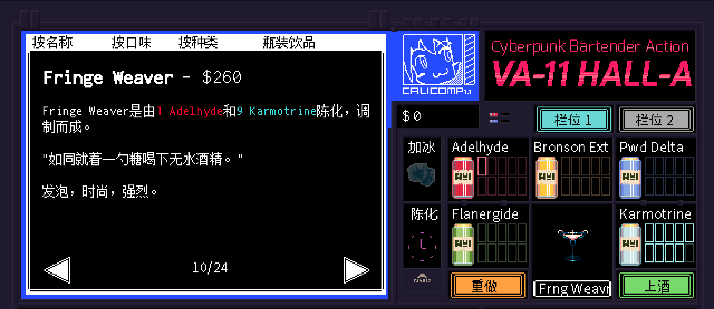

```haskell
record DrinkMenu where
	constructor MkDrinkMenu
	spiritIngredients : List String
	allIngredients    : List String

myFringeWeaverMenu : DrinkMenu
myFringeWeaverMenu = MkDrinkMenu
	["波本威士忌"]
	["波本威士忌", "味美思酒", "苹果汁", "苏打水"]

```

# <span style="color:#CD853F; font-weight:bold;">Fringe Weaver</span>


## **配料：**
```markdown
波本威士忌 2 oz
味美思酒 0.25 oz
苹果汁 0.5 oz
苦精 2酹
方糖 1块
苏打水 2 oz
```


## **制作步骤：**
```markdown
1. 将方糖放入玻璃杯底部，加入两酹苦精，然后用勺子压碎（讲究一点的话就用捣棒）。
2. 将波本威士忌、味美思酒和苹果汁放入装满冰块的摇壶中。
3. 盖好摇壶用力摇和，之后将酒液倒入玻璃杯中。
4. 加入2盎司苏打水，用柠檬皮装饰杯口。
```


