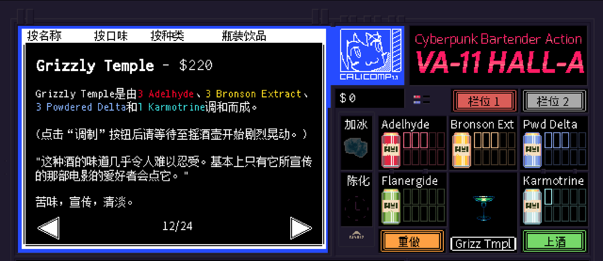

# <span style="color:#66CDAA; font-weight:bold;">Grizzly Temple</span>


**配料：**

伏特加 1盎司        薄荷酒 1盎司        青柠汁 0.5盎司

姜汁啤酒 2盎司        薄荷叶（用于装饰） 若干

**制作步骤：**

1 将伏特加、薄荷酒和青柠汁放入装满冰块的摇壶中。

2 盖上摇壶用力摇和，然后过滤到玻璃杯中；如有需要，可以加入摇壶中的冰块。

3 加入姜汁啤酒，用薄荷叶装饰杯边。

```haskell
record DrinkMenu where
	constructor MkDrinkMenu
	spiritIngredients : List String
	allIngredients    : List String

myGrizzlyTempleMenu : DrinkMenu
myGrizzlyTempleMenu = MkDrinkMenu
	["伏特加", "姜汁啤酒"]
	["伏特加", "薄荷酒", "青柠汁", "姜汁啤酒"]

```


