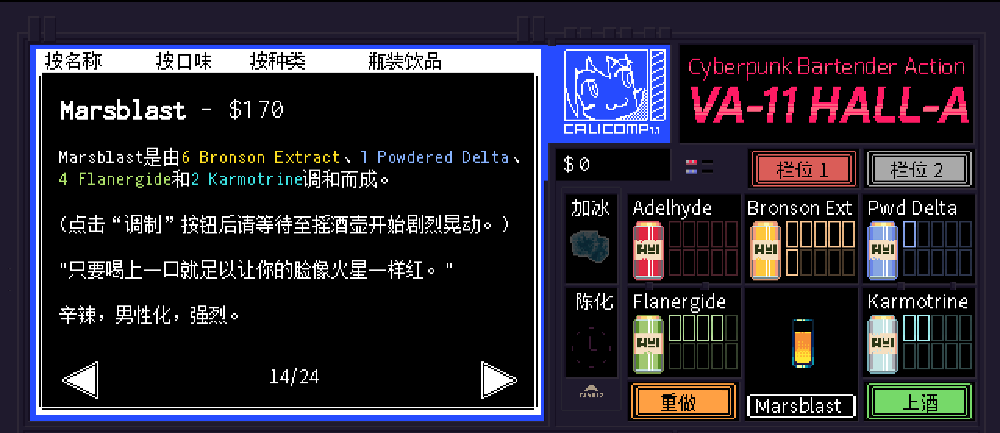

```haskell
record DrinkMenu where
	constructor MkDrinkMenu
	spiritIngredients : List String
	allIngredients    : List String

myMarsblastMenu : DrinkMenu
myMarsblastMenu = MkDrinkMenu
	["龙舌兰"]
	["龙舌兰", "柠檬汁", "橙汁", "辣酱", "汤力水"]

```

# <span style="color:#FFC107; font-weight:bold;">Marsblast</span>


## **配料：**
```markdown
龙舌兰 2 oz
柠檬汁 1 oz
橙汁 3 oz
苦精 2酹
辣酱 1/4茶匙
汤力水 1 oz
```


## **制作步骤：**
```markdown
1. 将除汤力水外的所有配料放入装满冰块的摇壶中。
2. 盖上摇壶用力摇和，然后过滤到玻璃杯中；如有需要，可以加入摇壶中的冰块。
3. 加入汤力水，搅拌均匀。
```


