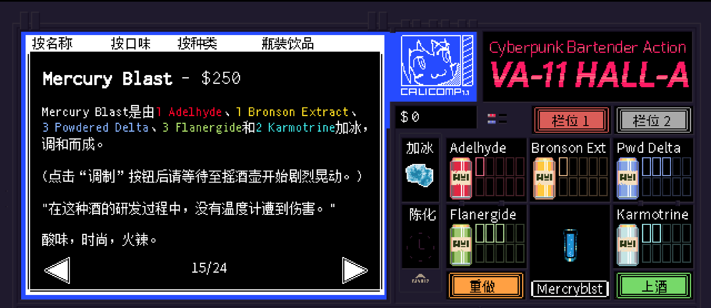

# <span style="color:#4682B4; font-weight:bold;">Mercuryblast</span>

口味：酸味        类型：时尚、火辣        调制方式：加冰、调和

**配料：**

肉桂威士忌 1盎司        蓝橙利口酒 0.5盎司        柠檬汁 0.75盎司

**制作步骤：**

1 将所有配料加入装满冰块的摇壶中。

2 盖好摇壶，用力摇晃混合。

3 将过滤的酒液倒入玻璃杯中；如有需要，可以加入摇壶中的冰块；这款饮品的量够装两子弹杯。

```haskell
record DrinkMenu where
	constructor MkDrinkMenu
	spiritIngredients : List String
	allIngredients    : List String

myMercuryblastMenu : DrinkMenu
myMercuryblastMenu = MkDrinkMenu
	["肉桂威士忌", "蓝橙利口酒"]
	["肉桂威士忌", "蓝橙利口酒", "柠檬汁"]

```


