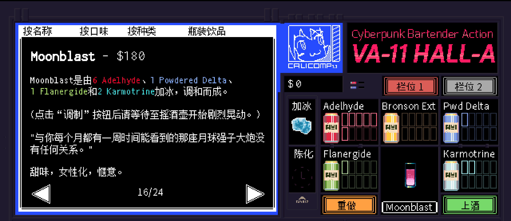

```haskell
record DrinkMenu where
	constructor MkDrinkMenu
	spiritIngredients : List String
	allIngredients    : List String

myMoonblastMenu : DrinkMenu
myMoonblastMenu = MkDrinkMenu
	["白朗姆酒", "蓝橙利口酒"]
	["白朗姆酒", "蓝橙利口酒", "单一糖浆", "石榴汁", "菠萝汁", "苏打水"]

```

# <span style="color:#E6678A; font-weight:bold;">Moonblast</span>


## **配料：**
```markdown
白朗姆酒 1.5 oz
蓝橙利口酒 少许
单一糖浆 1 oz
石榴汁 1 oz
菠萝汁 0.25 oz
苏打水 2 oz
```


## **制作步骤：**
```markdown
1. 将除苏打水外的所有配料放入装满冰块的摇壶中。
2. 盖上摇壶用力摇和，然后过滤到玻璃杯中；如有需要，可以加入摇壶中的冰块。
3. 加入苏打水，搅拌均匀。
```


