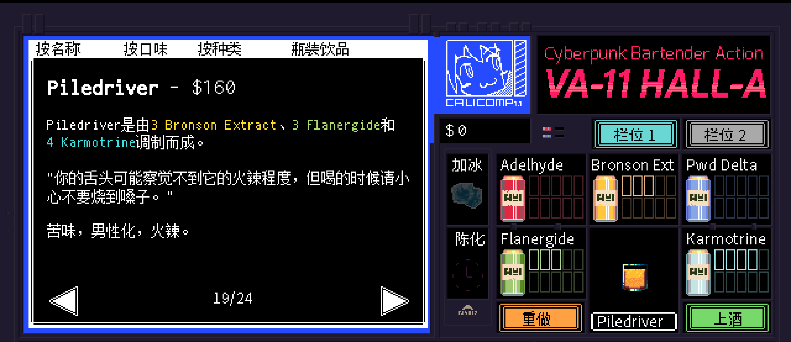

# <span style="color:#FF8C00; font-weight:bold;">Piledriver</span>

口味：苦味        类型：男性化、火辣        调制方式：调和

**配料：**

伏特加 1.5盎司        橙味利口酒 0.5盎司        橙汁 2盎司        苦精 4酹

**制作步骤：**

1 将所有配料放入装满冰块的摇壶中。

2 盖上摇壶用力摇和，然后过滤到玻璃杯中；如有需要，可以加入摇壶中的冰块。

3 用橙皮装饰杯边。

```haskell
record DrinkMenu where
	constructor MkDrinkMenu
	spiritIngredients : List String
	allIngredients    : List String

myPiledriverMenu : DrinkMenu
myPiledriverMenu = MkDrinkMenu
	["伏特加", "橙味利口酒"]
	["伏特加", "橙味利口酒", "橙汁"]

```


