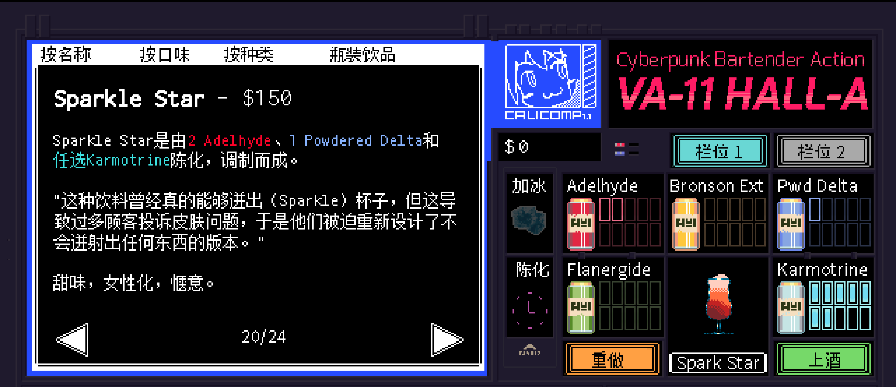

# <span style="color:#FF6347; font-weight:bold;">Sparkle Star</span>

口味：甜味        类型：女性化、愉悦        调制方式：陈化、调和

**配料：**

伏特加 2盎司        单一糖浆 1盎司        青柠汁 0.5盎司        蔓越莓汁 3盎司

红石榴糖浆 0.5盎司        蛋白  1个        可食用光泽粉（可选）

**制作步骤：**

1 将除汤力水外的所有配料放入装满冰块的摇壶中。如果使用光泽粉的话，先加入光泽粉。

2 盖上摇壶用力摇和。

3 去掉摇壶上盖，将酒液和冰块一起倒入杯中。

4 用一片杨桃装饰杯边。


**无酒精版**

苹果汁 2盎司        单一糖浆 1盎司        青柠汁 0.5盎司        蔓越莓汁 3盎司

石榴糖浆 0.5盎司        蛋白 1盎司        可食用光泽粉（可选）

```haskell
record DrinkMenu where
	constructor MkDrinkMenu
	spiritIngredients : List String
	allIngredients    : List String

mySparkleStarMenu : DrinkMenu
mySparkleStarMenu = MkDrinkMenu
	["伏特加"]
	["伏特加", "单一糖浆", "青柠汁", "蔓越莓汁", "红石榴糖浆", "蛋白", "可食用光泽粉", "苹果汁", "石榴糖浆"]

```


