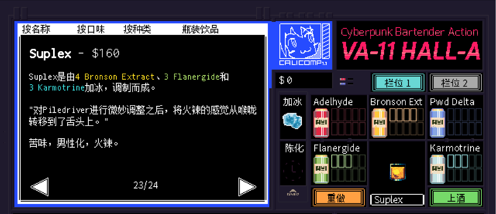

# Suplex

口味：苦味        类型：男性化、火辣        调制方式：加冰、调和

**配料：**

伏特加 1.5盎司        阿佩罗利口酒 0.5盎司       橙汁 2盎司        苦精 8酹

**制作步骤：**

1 将所有配料放入装满冰块的摇壶中。

2 盖上摇壶用力摇和，然后过滤到玻璃杯中；如有需要，可以加入摇壶中的冰块。

3 用橙片和最Man的纸伞装饰杯边（笑）

```haskell
record DrinkMenu where
	constructor MkDrinkMenu
	spiritIngredients : List String
	allIngredients    : List String

mySuplexMenu : DrinkMenu
mySuplexMenu = MkDrinkMenu
	["伏特加", "阿佩罗利口酒"]
	["伏特加", "阿佩罗利口酒", "橙汁"]

```


