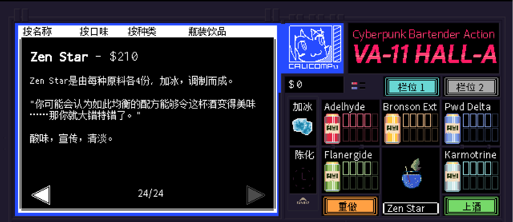

# Zen Star

口味：酸味        类型：宣传、清淡        调制方式：加冰、调和

**配料：**

清酒 3盎司        冰绿茶 6盎司        单一糖浆 2盎司

柠檬汁 1盎司        全脂牛奶 1/3 杯        蝶豆花粉末 1/4 茶匙（可选）

**制作步骤：**

1 将前四种配料放入装有1/3杯的牛奶中；不要搅拌摇晃，静置一小时等待其凝固。

2 在滤杯上铺一层咖啡滤纸，架在碗或量杯上；将凝固物倒在滤纸上过滤1小时，或放入冰箱过滤整晚。

3 拿掉滤杯，将蝶豆花粉末放进澄清后的液体中搅拌；把酒液倒在装有冰块的杯中享用。

```haskell
record DrinkMenu where
	constructor MkDrinkMenu
	spiritIngredients : List String
	allIngredients    : List String

myZenStarMenu : DrinkMenu
myZenStarMenu = MkDrinkMenu
	["清酒"]
	["清酒", "冰绿茶", "单一糖浆", "柠檬汁", "全脂牛奶", "蝶豆花粉末"]

```


